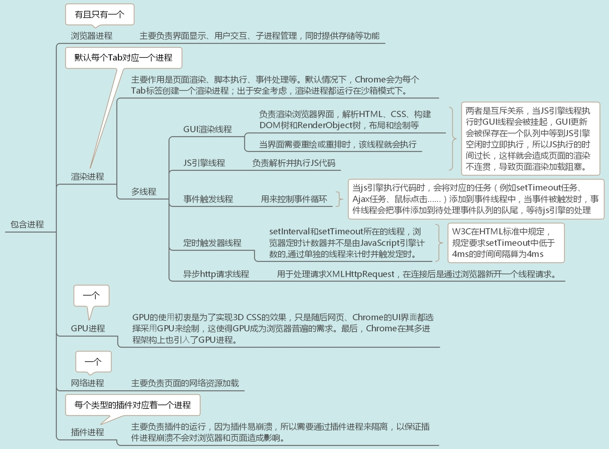

>  https://time.geekbang.org/column/article/116572

## 1. 浏览器架构

## 2. 跨站脚本攻击（XSS）

### 1. 存储型 XSS 攻击

- 首先黑客利用站点漏洞将一段恶意 JavaScript 代码提交到网站的数据库中；
- 然后用户向网站请求包含了恶意 JavaScript 脚本的页面；
- 当用户浏览该页面的时候，恶意脚本就会将用户的 Cookie 信息等数据上传到服务器。

### 2. 反射型 XSS 攻击

- 用户将一段含有恶意代码的请求提交给 Web 服务器，Web 服务器接收到请求时，又将恶意代码反射给了浏览器端

- Web 服务器不会存储反射型 XSS 攻击的恶意脚本，这是和存储型 XSS 攻击不同的地方。

### 3. 基于 DOM 的 XSS 攻击

基于 DOM 的 XSS 攻击是不牵涉到页面 Web 服务器的。具体来讲，黑客通过各种手段将恶意脚本注入用户的页面中，比如通过网络劫持在页面传输过程中修改 HTML 页面的内容，这种劫持类型很多，有通过 WiFi 路由器劫持的，有通过本地恶意软件来劫持的，它们的共同点是在 Web 资源传输过程或者在用户使用页面的过程中修改 Web 页面的数据。

### 4. 如何阻止 XSS 攻击

1. 服务器对输入脚本进行过滤或转码

2. 充分利用 CSP （使用https、来源域）

3. 使用 HttpOnly 属性

4. 添加验证码防止脚本冒充用户提交危险操作

5. 对于一些不受信任的输入，还可以限制其输入长度

## 3. 首屏显示

- DNS
- HTTP
- DOM 解析
- CSS 阻塞
- JavaScript 阻塞等

其中一项没处理好就可能导致整个页面的延时。

## 4. 禁止网站被iframe嵌套

`防止别人镜像自己的网站！`

在响应头里加一个X-Frame-Options: 

- DENY：浏览器拒绝当前页面加载任何Frame页面
- SAMEORIGIN：frame页面的地址只能为同源域名下的页面
- ALLOW-FROM origin：origin为允许frame加载的页面地址