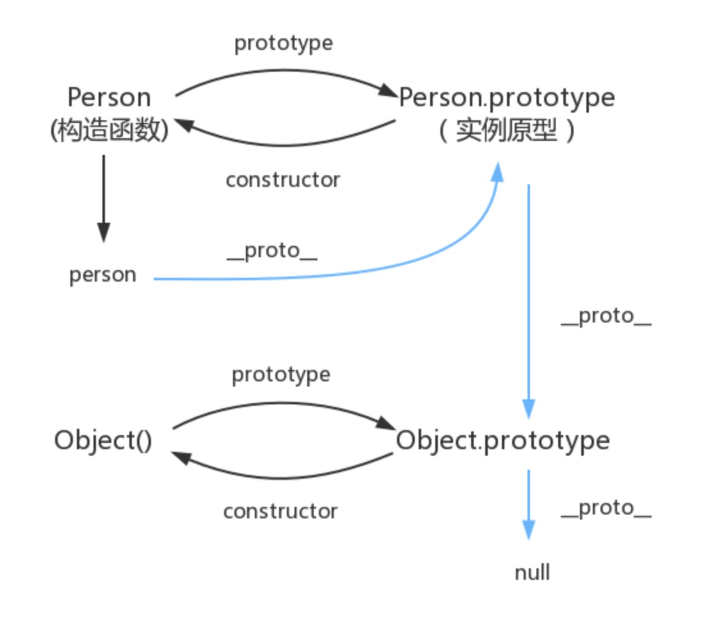

### 001.数组的总结

#### 0. 创建数组

```
// bad
var arr = new Array(1, 2);

// good
var arr = [1, 2];
```

#### 1. for

```

var a = [1, 2, 3];

// for循环
for(var i = 0; i < a.length; i++) {
  console.log(a[i]);
}

```

#### 2. while 、 do while

do while先执行后判断，循环至少执行一次，即便条件为false

while先判断后执行

```
var a = [1, 2, 3];

var i = 0;
while (i < a.length) {
  console.log(a[i]);
  i++;
}

var l = a.length;
while (l >= 0) {
  console.log(a[l]);
  l--
}
```

```
let i = 2;

do {
  console.lg(i);  // 2
  i++
} while (i < 2) {
  console.log(i);   // 3
}
```

#### 3. 判断一个 object 是否是数组

1. Array.isArray

```
var arr = [1, 2, 3];

typeof arr // "object"
Array.isArray(arr) // true
```

2. Object.prototype.toString

这里使用 call 来使 toString 中 this 指向 obj。进而完成判断
```
function isArray(obj){
 return Object.prototype.toString.call( obj ) === '[object Array]';
}
```

3. 原型链

基本思想: 实例如果是某个构造函数构造出来的那么 它的 `__proto__` 是指向构造函数的 prototype属性

```
function isArray(obj){
 return obj.__proto__ === Array.prototype;
}
```

#### 4. valueOf()，toString()

valueOf方法是一个所有对象都拥有的方法，返回指定对象的原始值。

不同对象的valueOf方法不尽一致，

```
// 数组的valueOf方法返回数组本身。
var arr = [1, 2, 3];
arr.valueOf() // [1, 2, 3]


// Boolean 布尔值
true.valueOf()  // true


// Date
const date = new Date();  // Fri Sep 10 2021 14:13:07 GMT+0800 (中国标准时间) {}
date.valueOf();  // 1631254411540

new Date().valueOf()   // 获取当前时间时间戳。 1631091318854

new Date('2021-09-09 10:00:00').valueOf()     // 把指定时间转为时间戳

// 把当前时间戳转为日期格式（年月日 -- 2021-09-10）
moment(
  new Date(new Date().valueOf()),
  "YYYY/MM/DD"
)                                             


// Function
new Function().valueOf()  // ƒ anonymous() {}


// Number
let n = new Number(1)
n.valueOf()   // 1


// Object
let o = new Object()
o.valueOf()   // {}


// String
'11'.valueOf()    // '11'


// Error
let e = new Error();
e.valueOf()       // Error  at <anonymous>:1:9


// Symbol
let s = Symbol()
s.valueOf()       // Symbol()

```


toString方法也是对象的通用方法，数组的toString方法返回数组的字符串形式。

```
var arr = [1, 2, 3];
arr.toString() // "1,2,3"

var arr = [1, 2, 3, [4, 5, 6]];
arr.toString() // "1,2,3,4,5,6"
```


#### 5. push()，pop() -- 改变原数组

```
var arr = [];

arr.push(1) // 1 返回数组长度1
arr.push('a') // 2 返回数组长度2
arr.push(true, {}) // 4  返回数组长度4
arr // [1, 'a', true, {}]  原数组被改变
```

```
var arr = ['a', 'b', 'c'];

arr.pop() // 'c' 返回被删除的元素c
arr // ['a', 'b']   原数组被改变
```

后进先出”的栈结构（stack）

```
var arr = [];
arr.push(1, 2);
arr.push(3);
arr.pop();
arr // [1, 2]
```

#### 6. shift()，unshift() -- 改变原数组

```
let a = ['a', 'b', 'c'];

a.shift() // 'a'  返回被删除的元素
a // ['b', 'c']
```

#### 7. join()

```
let a = [1, 2, 3, 4];

a.join(' ') // '1 2 3 4'
a.join(' | ') // "1 | 2 | 3 | 4"
a.join() // "1,2,3,4"  默认用逗号分隔

[undefined, null].join('#')
// '#'  如果数组成员是undefined或null或空位，会被转成空字符串

['a',, 'b'].join('-')
// 'a--b'  如果数组成员是undefined或null或空位，会被转成空字符串
```

通过call方法，这个方法也可以用于字符串或类似数组的对象。

```
Array.prototype.join.call('hello', '-')
// "h-e-l-l-o"

var obj = { 0: 'a', 1: 'b', length: 2 };
Array.prototype.join.call(obj, '-')
// 'a-b'
```

#### 8. concat()

然后返回一个新数组，原数组不变

```
['hello'].concat(['world'])
// ["hello", "world"]

['hello'].concat(['world'], ['!'])
// ["hello", "world", "!"]

[].concat({a: 1}, {b: 2})
// [{ a: 1 }, { b: 2 }]

[2].concat({a: 1})
// [2, {a: 1}]
```

除了数组作为参数，concat也接受其他类型的值作为参数，添加到目标数组尾部。

```
[1, 2, 3].concat(4, 5, 6)
// [1, 2, 3, 4, 5, 6]
```

如果数组成员包括对象，concat方法返回当前数组的一个浅拷贝。所谓“浅拷贝”，指的是新数组拷贝的是对象的引用。

```
var obj = { a: 1 };
var oldArray = [obj];

var newArray = oldArray.concat();

obj.a = 2;
newArray[0].a // 2
```

#### 9. reverse() -- 改变原数组

返回改变后的数组

```
let a = ['a', 'b', 'c'];

a.reverse() // ["c", "b", "a"]
a // ["c", "b", "a"]
```

#### 10. slice() -- 不改变

提取目标数组的一部分，返回一个新数组，**浅拷贝数组的元素**

> 字符串也有一个 slice() 方法是用来提取字符串的，不要弄混了。

```
 let a = [{name: 'OBKoro1'}, {name: 'zhangsan'}];
 let b = a.slice(0,1);
 console.log(b, a); 
 // [{"name":"OBKoro1"}]  [{"name":"OBKoro1"}]
 a[0].name='改变原数组';
 console.log(b,a); 
 // [{"name":"改变原数组"}] [{"name":"改变原数组"}]
```

slice()方法的一个重要应用，是将类似数组的对象转为真正的数组。

```
Array.prototype.slice.call({ 0: 'a', 1: 'b', length: 2 })
// ['a', 'b']

Array.prototype.slice.call(document.querySelectorAll("div"));
Array.prototype.slice.call(arguments);
```


#### 11. splice() -- 改变原数组

删除原数组的一部分成员，并可以在删除的位置添加新的数组成员，返回值是被删除的元素。


```
let a = [1, 2, 3, 4, 5, 6, 7];
let item = a.splice(0, 3); // [1,2,3]
console.log(a); // [4,5,6,7]
// 从数组下标0开始，删除3个元素
let item1 = a.splice(0,3,'添加'); // [4,5,6]
console.log(a); // ['添加',7]
// 从数组下标0开始，删除3个元素，并添加元素'添加'
```

#### 12. sort() -- 改变原数组

sort方法对数组成员进行排序，默认是按照字典顺序排序。


```
['d', 'c', 'b', 'a'].sort()
// ['a', 'b', 'c', 'd']

[4, 3, 2, 1].sort()
// [1, 2, 3, 4]

[11, 101].sort()
// [101, 11]  数值会被先转成字符串，再按照字典顺序进行比较，所以101排在11的前面。

[10111, 1101, 111].sort()
// [10111, 1101, 111]  数值会被先转成字符串，再按照字典顺序进行比较，所以101排在11的前面。


[10111, 1101, 111].sort(function (a, b) {
  return a - b;  // 大于0，表示第一个成员排在第二个成员后面
})
// [111, 1101, 10111]
```

```
[
  { name: "张三", age: 30 },
  { name: "李四", age: 24 },
  { name: "王五", age: 28  }
].sort(function (o1, o2) {
  return o1.age - o2.age;
})
// [
//   { name: "李四", age: 24 },
//   { name: "王五", age: 28  },
//   { name: "张三", age: 30 }
// ]
```


#### 13. map()
运行结果组成一个新数组返回，原数组没有变化。

```
var numbers = [1, 2, 3];

numbers.map(function (n, index, numbers) {
  return n + 1;
});
// [2, 3, 4]

numbers
// [1, 2, 3]
```

map()方法的第二个参数，将回调函数内部的this对象，指向arr数组

```
var arr = ['a', 'b', 'c'];

[1, 2].map(function (e) {
  return this[e];
}, arr)
// ['b', 'c']
```

map()方法不会跳过undefined和null，但是会跳过空位

```
var f = function (n) { return 'a' };

[1, undefined, 2].map(f) // ["a", "a", "a"]
[1, null, 2].map(f) // ["a", "a", "a"]
[1, , 2].map(f) // ["a", , "a"]
```


#### 14. forEach()

如果数组遍历的目的是为了得到返回值，那么使用map()方法，否则使用forEach()方法。

forEach()方法无法中断执行，总是会将所有成员遍历完。如果希望符合某种条件时，就中断遍历，要使用for循环。


```
function log(element, index, array) {
  console.log('[' + index + '] = ' + element);
}

[2, 5, 9].forEach(log);
// [0] = 2
// [1] = 5
// [2] = 9
```

#### 15. filter()

满足条件的成员组成一个新数组返回。

该方法不会改变原数组。

```
[1, 2, 3, 4, 5].filter(function (elem) {
  return (elem > 3);
})
// [4, 5]
```

#### 16. some()，every()

返回一个布尔值，表示判断数组成员是否符合某种条件。

```
var arr = [1, 2, 3, 4, 5];
arr.some(function (elem, index, arr) {
  return elem >= 3;
});
// true 只要有一个满足就返回true
```

```
var arr = [1, 2, 3, 4, 5];
arr.every(function (elem, index, arr) {
  return elem >= 3;
});
// false  必须所有的都满足才返回true
```

注意，对于空数组，some方法返回false，every方法返回true，回调函数都不会执行。

```
function isEven(x) { return x % 2 === 0 }

[].some(isEven) // false
[].every(isEven) // true
```

#### 17. reduce()，reduceRight() 

reduce是从左到右处理（从第一个成员到最后一个成员）

```
[1, 2, 3, 4, 5].reduce(function (a, b) {
  console.log(a, b);
  return a + b;
})
// 1 2
// 3 3
// 6 4
// 10 5
//最后结果：15
```

如果要对累积变量指定初值，可以把它放在reduce方法和reduceRight方法的第二个参数。

```
[1, 2, 3, 4, 5].reduce(function (a, b) {
  return a + b;
}, 10);
// 25


function add(prev, cur) {
  return prev + cur;
}

[].reduce(add)
// TypeError: Reduce of empty array with no initial value
[].reduce(add, 1)
// 1
```

找出字符长度最长的数组成员

```
function findLongest(entries) {
  return entries.reduce(function (longest, entry) {
    return entry.length > longest.length ? entry : longest;
  }, '');
}

findLongest(['aaa', 'bb', 'c']) // "aaa"
```

#### 18. indexOf()，lastIndexOf() --  includes()

在es7中我们使用 inclueds 来判断数组中是否包含某个元素

```
let a = ['a', 'b', 'c'];

a.inclues('b') // true

if(a.inclues('b')){ ... }
```

indexOf方法返回给定元素在数组中第一次出现的位置，如果没有出现则返回-1。

```
let a = ['a', 'b', 'c'];

a.indexOf('b') // 1
a.indexOf('y') // -1

if(a.indexOf('b') > -1) { ... }   //  这个更简洁
```

indexOf方法还可以接受第二个参数，表示搜索的开始位置。

```
['a', 'b', 'c'].indexOf('a', 1) // -1
```

lastIndexOf方法返回给定元素在数组中最后一次出现的位置，如果没有出现则返回-1。

```
var a = [2, 5, 9, 2];
a.lastIndexOf(2) // 3
a.lastIndexOf(7) // -1
```

注意，这两个方法不能用来搜索NaN的位置，即它们无法确定数组成员是否包含NaN。

这是因为这两个方法内部，使用严格相等运算符（===）进行比较，而NaN是唯一一个不等于自身的值。

```
[NaN].indexOf(NaN) // -1
[NaN].lastIndexOf(NaN) // -1
```

#### 19. 链式使用

```
var users = [
  {name: 'tom', email: 'tom@example.com'},
  {name: 'peter', email: 'peter@example.com'}
];

users
.map(function (user) {
  return user.email;
})
.filter(function (email) {
  return /^t/.test(email);
})
.forEach(function (email) {
  console.log(email);
});
// "tom@example.com"
```


#### 20. find()、 findIndex()

获取数组中年龄大于 18 的第一个元素

这两个方法都可以识别 NaN,弥补了 indexOf 的不足.

```
[1, 4, -5, 10,NaN].find((n) => Object.is(NaN, n)); 
// 返回元素NaN
[1, 4, -5, 10].findIndex((n) => n < 0); 
// 返回索引2
```

如果没有符合条件的元素返回 undefined

find() 对于空数组，函数是不会执行的。


#### 21. for ... of

一个数据结构只要部署了Symbol.iterator属性，就被视为具有 iterator 接口，就可以用for...of循环遍历它的成员

```
const arr = ['red', 'green', 'blue'];

for(let v of arr) {
  console.log(v); // red green blue
}
```

```
const arr = [
  {name: 'jake', age: 18},
  {name: 'joy', age: 19},
  {name: 'mike', age: 20},
  {name: 'tom', age: 21}
]

for(let item of arr) {
  console.log(item);
  // {name: 'jake', age: 18},
  // {name: 'joy', age: 19},
  // {name: 'mike', age: 20},
  // {name: 'tom', age: 21}
}
```

1. 无法遍历对象

2. 结果是数据的每一项

3. 不会遍历自定义属性

```
const arr = ['red', 'green', 'blue'];

arr.name = 'mke';

for(let v of arr) {
  console.log(v); // red green blue
}

```


#### 22. copyWithin() - ES6 -- 改变原数组

指定位置的成员复制到其他位置

```
 let a = ['zhang', 'wang', 'zhou', 'wu', 'zheng'];
 // 1位置开始被替换, 2位置开始读取要替换的  5位置前面停止替换
 a.copyWithin(1, 2, 5);
 // ["zhang", "zhou", "wu", "zheng", "zheng"]
```


#### 23. fill() - ES6 -- 改变原数组

填充数组

```
['a', 'b', 'c'].fill(7)
// [7, 7, 7]
['a', 'b', 'c'].fill(7, 1, 2)
// ['a', 7, 'c']
```


#### 24. cancat

合并两个或多个数组

```
let a = [1, 2, 3];
let b = [4, 5, 6];
//连接两个数组
let newVal=a.concat(b); // [1,2,3,4,5,6]
```


#### 25. 扩展运算符

```
let a = [2, 3, 4, 5]
let b = [ 4,...a, 4, 4]
console.log(a,b); 
//[2, 3, 4, 5] [4,2,3,4,5,4,4]
```


#### 26. keys()、values()、entries()

```
for (let index of ['a', 'b'].keys()) {
  console.log(index);
}
// 0
// 1    
for (let elem of ['a', 'b'].values()) {
  console.log(elem);
}
// 'a'
// 'b'    
for (let [index, elem] of ['a', 'b'].entries()) {
  console.log(index, elem);
}
// 0 "a"
// 1 "b"
```


### 002.对象的方法

#### 1. in 运算符

```
var obj = { p: 1 };

'p' in obj // true

'toString' in obj // true
```

in运算符的一个问题是，它不能识别哪些属性是对象自身的，哪些属性是继承的。

通过  hasOwnProperty 解决 -- hasOwnProperty() 方法会返回一个布尔值，指示对象自身属性中是否具有指定的属性

```
const object1 = {};
object1.property1 = 42;

console.log(object1.hasOwnProperty('property1'));
// expected output: true

console.log(object1.hasOwnProperty('toString'));
// expected output: false

console.log(object1.hasOwnProperty('hasOwnProperty'));
// expected output: false
```

转换成源码使用的模式 -- 去掉无用的数据

```
let object = {
  react: {
    number1: 18,
    number2: 19,
    children: {
      test: {
        number1: 20,
        number2: 21,
        default: 22
      },
      mocha: {
        number1: 30,
        number2: 31,
        children: {
          mocha1: {
            number1: 401,
            number2: 411,
            default: 421
          },
          mocha2: {
            number1: 402,
            number2: 412,
            default: 422
          },
          mocha3: {
            number1: 403,
            number2: 413,
            default: 423
          }
        }
      }
    }
  },
  vue: {
    number1: 18,
    number2: 20,
    default: 12
  }
}
const objectLoop = (object) => {
  const data = {};
  for (const key in object) {
    if (Object.prototype.hasOwnProperty.call(object, key)) {
      const props = object[key];
      if (props && props.children) {
        data[key] = objectLoop(object[key].children);
      } else {
        data[key] = props.default;
      }
    }
  }
  return data;
};

objectLoop(object)

{
  react: {
    mocha: {
      mocha1: 421,
      mocha2: 422,
      mocha3: 422
    },
    test: 22
  },
  vue: 12
}
```

#### 2. for ... in

不推荐使用for...in遍历数组

```
// 1. 它遍历的是对象所有可遍历（enumerable）的属性，会跳过不可遍历的属性。

// 2. 它不仅遍历对象自身的属性，还遍历继承的属性。

var obj = {a: 1, b: 2, c: 3};

for (var i in obj) {
  console.log('键名：', i);
  console.log('键值：', obj[i]);
}
// 键名： a
// 键值： 1
// 键名： b
// 键值： 2
// 键名： c
// 键值： 3
```

如果继承的属性是可遍历的，那么就会被for...in循环遍历到

需要通过 hasOwnProperty 过滤一下

```
var person = { name: '老张' };

for (var key in person) {
  if (person.hasOwnProperty(key)) {
    console.log(key);
  }
}
// name
```

#### 3. with 语句

建议不要使用with语句


#### 4. Object.create()

构造函数作为模板，可以生成实例对象。但是，有时拿不到构造函数，只能拿到一个现有的对象。

```
var person1 = {
  name: '张三',
  age: 38,
  greeting: function() {
    console.log('Hi! I\'m ' + this.name + '.');
  }
};

var person2 = Object.create(person1);

person2.name // 张三
person2.greeting() // Hi! I'm 张三.
```

### 1. derfer和async的区别

`把 JavaScript 插入到 HTML 页面中要使用<script>元素，该元素有两个属性defer(延迟脚本)和async(异步脚本)。`

defer是表明脚本在执行时不会影响页面的构造。也就是说，脚本会被延迟到整个页面都解析完毕后再运行。浏览器渲染页面，读取到包含defer属性的外部`<script>`标签时不会停止DOM渲染，而是异步下载，加载完整个页面再运行js。有多个defer的标签时，会按照顺序下载执行。


async浏览器立即异步下载文件，不同于defer得是，下载完成会立即执行，此时会阻塞dom渲染，所以async的script最好不要操作dom。因为是下载完立即执行，不能保证多个加载时的先后顺序。


### 2. 节流防抖的原理和使用场景

```
防抖: 每次触发事件时都取消之前的延时调用方法
function debounce(fn) {
  let timeout = null; // 创建一个标记用来存放定时器的返回值
  return function () {
    clearTimeout(timeout); // 每当用户输入的时候把前一个 setTimeout clear 掉
    timeout = setTimeout(() => { 
    // 然后又创建一个新的 setTimeout, 
    // 这样就能保证输入字符后的 interval 间隔内如果还有字符输入的话，就不会执行 fn 函数
    fn.apply(this, arguments);
   }, 500);
 };
}
function sayHi() {
  console.log('防抖成功');
}

var inp = document.getElementById('inp');
inp.addEventListener('input', debounce(sayHi)); // 防抖

节流: 高频事件触发，但在n秒内只会执行一次，所以节流会稀释函数的执行频率
function throttle(fn) {
  let canRun = true; // 通过闭包保存一个标记
  return function () {
    if (!canRun) return; // 在函数开头判断标记是否为true，不为true则return
    canRun = false; // 立即设置为false
    setTimeout(() => { // 将外部传入的函数的执行放在setTimeout中
     fn.apply(this, arguments);
     // 最后在setTimeout执行完毕后再把标记设置为true(关键)表示可以执行下一次循环了。
     // 当定时器没有执行的时候标记永远是false，在开头被return掉
     canRun = true;
    }, 500);
  };
}
function sayHi(e) {
 console.log(e.target.innerWidth, e.target.innerHeight);
}
window.addEventListener('resize', throttle(sayHi));

```

```
应用场景:

debounce
1. 登录、发短信等按钮避免用户点击太快，以致于发送了多次请求，需要防抖
2. 调整浏览器窗口大小时，resize 次数过于频繁，造成计算过多，此时需要一次到位，就用到了防抖
3. 文本编辑器实时保存，当无任何更改操作一秒后进行保存

throttle
1. scroll 事件，每隔一秒计算一次位置信息等
2. 浏览器播放事件，每隔一秒计算一次进度信息等
3. input框实时搜索并发送请求展示下拉列表，每隔一秒发送一次请求 (也可做防抖)

```

防抖：https://codesandbox.io/s/dongbeidaluantun-8kvzu?file=/src/001/debounce.js

### 3. 高阶函数/组件

> https://codesandbox.io/s/gaojiezujian-8kvzu?file=/src/1HocWindowInnerHeight.js


### 4. 组件的参数类型校验

> https://www.npmjs.com/package/prop-types


### 5. JS获取对象数组特定key对应的值数组

```
function getMappingValueArrayOfKey(array,keyName){
  // 也可以用 Array.is(array)，这个更简洁
	if(Object.prototype.toString.call(array)=='[object Array]'){
		return array.map((item,index)=>{
			return item[keyName]
		})
	}
	return 'null（参数一应为对象数组）';//不是数组
}

const animals=[{name:'dog',sound:'汪汪'},{name:'pig',sound:'哼哼'},{name:'cat',sound:'喵喵'}]

console.log(getMappingValueArrayOfKey(animals,'name'));//["dog", "pig", "cat"]
console.log(getMappingValueArrayOfKey(animals,'sound'));//["汪汪", "哼哼", "喵喵"]

```

### 6. Promise

> https://wangdoc.com/es6/promise.html

#### 1. 缺点

1. 无法取消Promise，一旦新建它就会立即执行，无法中途取消

2. 如果不设置回调函数，Promise内部抛出的错误，不会反应到外部

3. 当处于pending状态时，无法得知目前进展到哪一个阶段（刚刚开始还是即将完成）

如果某些事件不断地反复发生，一般来说，使用 Stream 模式是比部署Promise更好的选择。


#### 2. 注意

一般来说，不要在then()方法里面定义 Reject 状态的回调函数（即then的第二个参数），总是使用catch方法。


一般总是建议，Promise 对象后面要跟catch()方法，这样可以处理 Promise 内部发生的错误。

#### 3. catch/then

catch() 是 then 第二个参数的语法糖

catch()方法返回的还是一个 Promise 对象，因此后面还可以接着调用then()方法。


then方法返回的是一个新的Promise实例（注意，不是原来那个Promise实例）。因此可以采用链式写法，即then方法后面再调用另一个then方法。

```
const someAsyncThing = function() {
  return new Promise(function(resolve, reject) {
    // 下面一行会报错，因为x没有声明
    resolve(x + 2);
  });
};

someAsyncThing()
.catch(function(error) {
  console.log('oh no', error);
})
.then(function() {
  console.log('carry on');
});
// oh no [ReferenceError: x is not defined]
// carry on
```


#### 4. finally()

不管 Promise 对象最后状态如何，都会执行的操作


服务器使用 Promise 处理请求，然后使用finally方法关掉服务器

```
server.listen(port)
  .then(function () {
    // ...
  })
  .finally(server.stop);
```

finally方法的回调函数不接受任何参数，这意味着没有办法知道，前面的 Promise 状态到底是fulfilled还是rejected。这表明，finally方法里面的操作，应该是与状态无关的，不依赖于 Promise 的执行结果。


#### 5. all()

如果不是，就会先调用下面讲到的Promise.resolve方法，将参数转为 Promise 实例

只有都成功了，才会成功

参数的 Promise 实例，自己定义了catch方法，那么它一旦被rejected，并不会触发Promise.all()的catch方法。

```
// 生成一个Promise对象的数组
const promises = [2, 3, 5, 7, 11, 13].map(function (id) {
  return getJSON('/post/' + id + ".json");
});

Promise.all(promises).then(function (posts) {
  // ...
}).catch(function(reason){
  // ...
});
```

上面代码中，promises是包含 6 个 Promise 实例的数组，只有这 6 个实例的状态都变成fulfilled，或者其中有一个变为rejected，才会调用Promise.all方法后面的回调函数。


#### 6. race()

只要p1、p2、p3之中有一个实例率先改变状态，p的状态就跟着改变


```
const p = Promise.race([
  fetch('/resource-that-may-take-a-while'),
  new Promise(function (resolve, reject) {
    setTimeout(() => reject(new Error('request timeout')), 5000)
  })
]);

p
.then(console.log)
.catch(console.error);
```


#### 7. allSettled()

得到所有的状态，all只能得到全部成功的状态，和一个失败的状态，race只能得到最快的状态

```
const promises = [
  fetch('/api-1'),
  fetch('/api-2'),
  fetch('/api-3'),
];

await Promise.allSettled(promises);
removeLoadingIndicator();
```

上面示例中，数组promises包含了三个请求，只有等到这三个请求都结束了（不管请求成功还是失败），removeLoadingIndicator()才会执行。


#### 8. any()

等到一个成功的，除非全部失败

```
Promise.any([
  fetch('https://v8.dev/').then(() => 'home'),
  fetch('https://v8.dev/blog').then(() => 'blog'),
  fetch('https://v8.dev/docs').then(() => 'docs')
]).then((first) => {  // 只要有一个 fetch() 请求成功
  console.log(first);
}).catch((error) => { // 所有三个 fetch() 全部请求失败
  console.log(error);
});
```


#### 9. resolve()

有时需要将现有对象转为 Promise 对象，Promise.resolve()方法就起到这个作用。

```
const jsPromise = Promise.resolve($.ajax('/whatever.json'));
```

```
Promise.resolve('foo')
// 等价于
new Promise(resolve => resolve('foo'))
```


#### 10. reject()


```
const p = Promise.reject('出错了');
// 等同于
const p = new Promise((resolve, reject) => reject('出错了'))

p.then(null, function (s) {
  console.log(s)
});
// 出错了
```


#### 11. try()

让同步函数同步执行，异步函数异步执行

```
const f = () => console.log('now');
Promise.try(f);
console.log('next');
// now
// next
```

因为这样就可以不管f是否包含异步操作，都用then方法指定下一步流程，用catch方法处理f抛出的错误


## 7. async/await

async 函数是什么？一句话，它就是 Generator 函数的语法糖。


async函数对 Generator 函数的改进，体现在以下四点。

1. 内置执行器

2. 更好的语义

3. 更广的适用性

4. 返回值是 Promise


### 我们希望即使前一个异步操作失败，也不要中断后面的异步操作

否则会中断后面的执行，或者使用try catch

```
async function f() {
  await Promise.reject('出错了')
    .catch(e => console.log(e));
  return await Promise.resolve('hello world');
}

f()
.then(v => console.log(v))
// 出错了
// hello world
```


### 如果不存在继发关系，最好让它们同时触发。

```
// 写法一
let [foo, bar] = await Promise.all([getFoo(), getBar()]);

// 写法二
let fooPromise = getFoo();
let barPromise = getBar();
let foo = await fooPromise;
let bar = await barPromise;
```


### async 函数的实现原理


async 函数的实现原理，就是将 Generator 函数和自动执行器，包装在一个函数里。


## 8. 闭包


### 概念


闭包是指有权访问另外一个函数作用域中的变量的函数


### 闭包的应用场景

1. [防抖节流](http://localhost:3000/#/frontend/003/003javascript001?id=_2-%e8%8a%82%e6%b5%81%e9%98%b2%e6%8a%96%e7%9a%84%e5%8e%9f%e7%90%86%e5%92%8c%e4%bd%bf%e7%94%a8%e5%9c%ba%e6%99%af)


2. [函数柯里化](http://localhost:3000/#/frontend/003/003javascript001?id=_9-%e5%87%bd%e6%95%b0%e6%9f%af%e9%87%8c%e5%8c%96)


3. 给元素伪数组添加事件

其实也可以用let去做

```
// DOM操作
let li = document.querySelectorAll('li');
for(var i = 0; i < li.length; i++) {
    (function(i){
        li[i].onclick = function() {
            alert(i);
        }
    })(i)
}
```


4. 不使用循环返回数组

有点类似函数柯里化，保存上一个函数的值

```
function getArr() {
    let num = 10;
    let arr = [];
    return (function(){
        arr.unshift(num);
        num--;
        if(num > 0) {
            arguments.callee();
        }
        return arr;
    })()
}
console.log(getArr());  //[1, 2, 3, 4, 5, 6, 7, 8, 9, 10]
```


5. 使用闭包模拟私有变量

```
  var counter = (function () {
    var privateCounter = 0;

    function changeBy(val) {
      privateCounter += val
    }
    return {
      increment: function () {
        changeBy(1)
      },
      decrement: function () {
        changeBy(-1)
      },
      value: function () {
        return privateCounter
      }
    }
  })();
  counter.value() //0
  counter.increment() //1
  counter.increment() //2
  counter.decrement() //1
```


## 9. 函数柯里化

柯里化本质上是降低通用性，提高适用性

递归调用柯里化函数，返回一个保存了上一个传入参数的函数，其实就是利用闭包来保存之前传入的参数，使得后续函数可以直接使用

[lodash 的函数柯里化 _.curry](http://localhost:3000/#/frontend/012/012method002?id=curry)

### 作用

1. 参数复用

2. 延迟执行

3. 动态创建

### 参数复用

需要根据参数拼接出几个完整的地址

```
// 常规实现
function spliceUrl(protocol, hostname, patchname) {
  return `${protocol}${hostname}${patchname}`;
}

const url1 = spliceUrl('https://', 'aa.com', '/get/aa/');
const url2 = spliceUrl('https://', 'aa.com', '/get/aa/');

```


```
// currying写法
function spliceUrl(protocol, hostname) {
  return function(patchname) {
      return `${protocol}${hostname}${patchname}`;
  }
}

const urlBase = spliceUrl('https://', 'aa.com');
const url1 = urlBase('/get/aa/')
const url2 = urlBase('/get/aa/');

```


### 延迟执行

在实现一个求和函数的时候，希望传入的参数能满足sum(1)(2)(3)(4);

```
function currying(func) { 
  const args = [];
  return function result(...rest) { 
    if (rest.length === 0)
      return func(...args);
      args.push(...rest);
      return result;
   }
 }
const add = (...args) => args.reduce((a, b) => a + b); 
const sum = currying(add);

console.log(sum(1)(2)(3)(4)()); // 10
```


### 动态创建

使用监听事件时，判断浏览器兼容性

```
const whichEvent = (function() {
    if (document.addEventListener) {
        return function(element, event, handler) {
            if (element && event && handler) {
                element.addEventListener(event, handler, false);
            }
        };
    } else {
        return function(element, event, handler) {
            if (element && event && handler) {
                element.attachEvent('on' + event, handler);
            }
        };
    }
})();

```


## 10. requestAnimationFrame (rAF -- cAF是取消)

window.requestAnimationFrame() 告诉浏览器——你希望执行一个动画，并且要求浏览器在下次重绘之前调用指定的回调函数更新动画。该方法需要传入一个回调函数作为参数，该回调函数会在浏览器下一次重绘之前执行


若你想在浏览器下次重绘之前继续更新下一帧动画，那么回调函数自身必须再次调用window.requestAnimationFrame()

> https://www.jianshu.com/p/fa5512dfb4f5


## 11. requestIdleCallback -- Window.cancelIdleCallback() 取消

当关注用户体验，不希望因为一些不重要的任务（如统计上报）导致用户感觉到卡顿的话，就应该考虑使用requestIdleCallback。因为requestIdleCallback回调的执行的前提条件是当前**浏览器处于空闲状态**。

> https://segmentfault.com/a/1190000014457824


## 12. 模块的理解

将一个复杂的程序依据一定的规则(规范)封装成几个块(文件), 并进行组合在一起
块的内部数据与实现是私有的, 只是向外部暴露一些接口(方法)与外部其它模块通信


### CommonJS(NodeJS)

把整个模块都加载进来，运行时加载 -- require、module.exports

```
// example.js
var x = 5;
var addX = function (value) {
  return value + x;
};
module.exports.x = x;
module.exports.addX = addX;

// 但是不推荐这么写，导入是一样的 require
```

```
// A文件
var firstName = "Michael";
var lastName = "Jackson";
var year = 1958;

module.exports = {
  firstName,
  lastName,
  year
};

// B文件
const Info = require('./A);
console.log(Info); // {firstName: "Michael", lastName: "Jackson", year: 1958}

// 当然，也可以使用解构赋值 -- 但是还是加载了整个对象
const { year } = require('./A);
console.log(year); // 1958
```


### ESModule(ES6 模块)

#### 单独导出

```
// A文件
// 单独导出第一种写法
export var firstName = "Michael";
export var lastName = "Jackson";
export var year = 1958;
```

```
// 单独导出第二种写法
var firstName = "Michael";
var lastName = "Jackson";
var year = 1958;

// 这个大括号只是大括号而已，它圈定哪些变量要被输出去
// commonjs module.export =后面接的真的是个对象
export { firstName, lastName, year };  
```

导入

```
// 一般写法
import { year } from "./A";
console.log(year); // 1958

// 重命名写法
import { year as thatYear } from ".A"; // 重命名变量
console.log(year); // 1958

// 导入全部模块并存在一个对象里
import * as Info from "./A";
console.log(Info); // Module {firstName: "Michael", lastName: "Jackson", year: 1958}
```

#### 默认导出

```
// A文件
var firstName = "Michael";
var lastName = "Jackson";
var year = 1958;

export default { nn: firstName, lastName, year }; // 现在就不报错了，因为后面跟的真的是一个对象
```

导入

```
import JacksonInfo from "./A";
console.log(JacksonInfo); // {firstName: "Michael", lastName: "Jackson", year: 1958}
```


#### 转发导出

```
export { year, firstName } from "./A";

// 上面这种写法基本等同于下面这两句，不过上面的写法有个特别之处，那就是转发导出的模块，是没有导入到当前模块的，所以才说和下面的写法“基本相同”
import { year, firstName } from "./A";
export { year, firstName };
```

### CommonJS 和 ES6 模块的区别

1. ES6模块是静态导入，编译时加载的；而CommonJS是动态导入，运行时加载的；

2. **ES6模块不使用默认导出时**，即使导出原始数据类型，导出的仍然是其引用。而CommonJS导出原始数据类型则只是导出一个值而已；

```
// CommonJS中
var num = 0

module.exports = { num }; // 就是导出 { num: 0 }这个对象而已
```

```
// ES6模块中
var num = 0

export { num }; // 导出当前num变量的指针，取值的时候都是跑回当前这个源模块来取
```

```
// ES6模块默认导出
var num = 0

export default num ; // 这样导出的东西又变成值了，而不是活指针
```


## 13. 纯函数？副作用？

#### 纯函数

1. 相同输入总是会返回相同的输出。

2. 不产生副作用。

3. 不依赖于外部状态。


#### 副作用

副作用（side-effect）是指让一个函数变得不再纯净（pure）的东西。一个纯净的函数，无论何时何地（any time any wherer）执行，都会得到稳定的结果，这对保障程序的稳定性和性能都有极大的帮助。那么反过来，如果一个函数不能any time any wherer得到稳定的结果，那这个函数就不是纯净的，就是有副作用了。


## 14. 跨域问题有哪些处理方式

跨域解决方案

1. 通过 jsonp 跨域

2. 跨域资源共享（CORS)

3. nodejs 中间件代理跨域

4. nginx 反向代理中设置 proxycookiedomain


## 15. 实例对象与 new 命令

> https://wangdoc.com/javascript/oop/new.html

### 构造函数

所谓”构造函数”，就是专门用来生成实例对象的函数。它就是对象的模板，描述实例对象的基本结构。一个构造函数，可以生成多个实例对象，这些实例对象都有相同的结构。(es6 是 class 语法糖)

```
var Vehicle = function () {
  this.price = 1000;
};
```

函数体内部使用了this关键字，代表了所要生成的对象实例。

生成对象的时候，必须使用new命令。


```
function Cat(name, color) {
  this.name = name;
  this.color = color;
  this.meow = function () {
    console.log('喵喵');
  };
}

var cat1 = new Cat('大毛', '白色');
var cat2 = new Cat('二毛', '黑色');

cat1.meow === cat2.meow
// false
```

cat1和cat2是同一个构造函数的两个实例，它们都具有meow方法。由于meow方法是生成在每个实例对象上面，所以两个实例就生成了两次。也就是说，每新建一个实例，就会新建一个meow方法。这既没有必要，又浪费系统资源，因为所有meow方法都是同样的行为，完全应该共享。


这个问题的解决方法，**就是 JavaScript 的原型对象（prototype）**。


### new 命令

new命令的作用，就是执行构造函数，返回一个实例对象

```
var Vehicle = function () {
  this.price = 1000;
};

var v = new Vehicle();
v.price // 1000
```

```
var Vehicle = function (p) {
  this.price = p;
};

var v = new Vehicle(500);
```


### new 命令的原理

1. 创建一个空对象，作为将要返回的对象实例。

2. 将这个空对象的`__proto__`属性，指向构造函数的prototype属性。

3. 将这个空对象赋值给函数内部的this关键字。

4. 开始执行构造函数内部的代码。


### 原型链

所有对象都有自己的原型对象（prototype）,由于原型对象也是对象，所以它也有自己的原型。因此，就会形成一个“原型链”（prototype chain）


### 原型的概念

每一个javascript对象(除null外)创建的时候，就会与之关联另一个对象，这个对象就是我们所说的原型，每一个对象都会从原型中“继承”属性。


### 图解




## 16. 继承有哪些方式

### 原型链继承