## webpack5 新特性

vite 提到了一个比较重要的概念 **bundless**

而在webpack中是基于 **bundle** 这种模式构建的

发布日志

> https://webpack.docschina.org/blog/2020-10-10-webpack-5-release/

## Node.js版本

使用webpack5，Node.js最低版本是 10.13.0

## 功能清除：清理弃用的能力

所有在 webpack4 里面被废弃的能力都被清除，所以要升级到 webpack5，要确保 webpack4 没有打印警告，

require.includes 语法已经被废弃

- 可以通过 Rule.parser.requireInclude 将该行为改为允许、废弃或禁用

require.includes 是 webpack 自身实现的一个语法，

作用：

- 加载一个模块，但并不马上执行，

目的：

- webpack 里面如果异步加载一个模块，比如有三个模块，比如 A 模块重复多次被加载，借助这个可以实现模块的预加载，这样其它模块要用的时候，就不需要重新加载一遍了

## 功能清除：不再为 Node.js 模块引用 polyfill

在以前的版本，只要某一个模块依赖 Node.js 里面的一个核心模块，那么这个模块打包的时候，它会把整个 Node.js 的 polyfill 都打进来，这会造成整个 bundle 的体积特别大

webpack 常规的大包输出环境是浏览器，但是 CryptoJS 是 Node.js 的一个模块，在浏览器端没有，但是因为把整个 polyfill 打包进来了，所以整个体积特别大

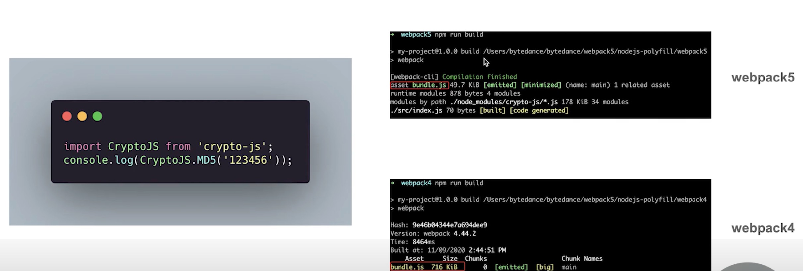

node-libs-browser

是因为上面这个包会判断浏览器环境，然后把 polifill 打进去

## 长期缓存：确定的模块 ID、chunk 和导出名称

1. 在 webpack5 打包的时候，它是有一个模块 ID 叫 moduleId 以及一个 chunkId

2. 在之前的版本，它给 ID 的一个处理的办法，它其实使用的是顺序的数字，那么只要我们某个模块的代码发生了变化，这个时候 webpack 会重新打包，又会用重新的顺序的数字，就会导致我们整个项目、用到的这些模块的文件名称都会发生变化 -- 文件一变，我们的缓存就失效了

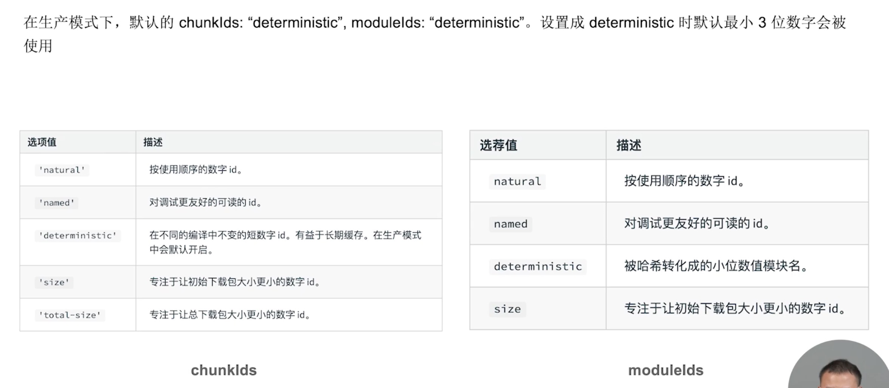

loadComponent 会异步的引入 text.js，通过动态的 import 语法，text.js 会被打成一个独立的模块（下图）

在我们点击按钮的时候，它会动态的加载这个模块

在 webpack4 里面是使用数字递增的（1、2、3等等），下图是 1.bundle.js

在 webpack5 里面是三位数字，下图是 687.bundle.js，并且这个数字也是确定的

假如有多个模块，通过动态导入这种方式导入进来的，我们不会因为某一个模块变化了而导致其它的都变化，

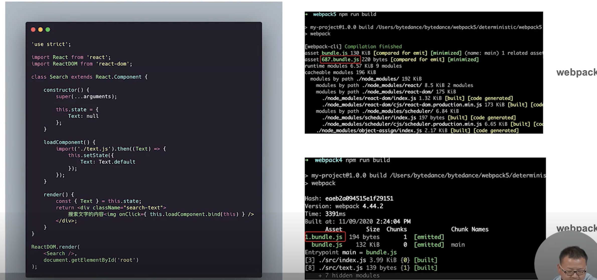

## 持久化缓存

提升二次打包速度 -- 缓存 （cache-loader、babel-loader），借助这些loader，它就会将编译的结果写入到硬盘里面

在 webpack5 中已经可以做到原生的去支持这个缓存，不用我们刻意的去引这种 cache-loader 这么麻烦了

1. 缓存策略

 - 首先是默认开启的

 - 默认使用内存缓存 -- 可以通过 cache 字段进行设置（下图），cache 默认是 memory，我们可以改成 filesystem（文件缓存），

 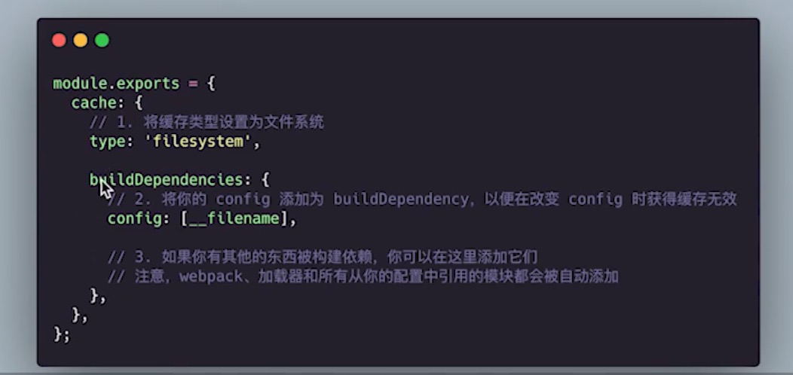

 - 淘汰机制，文件缓存默认是 node_module/.cache/webpack，最大大小 500MB，缓存两个星期

 ## 构建优化：Tree Shaking 优化 -- 嵌套的 Tree Shaking
 
 在 webpack4 中会输出一大段代码，在 webpack5 中只有一行

 inner.js 中的 b 没有用到，需要被处理掉

  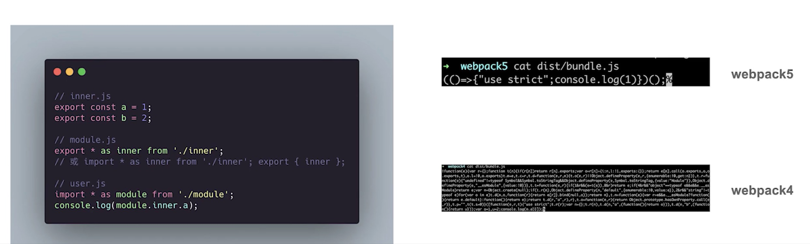

## 构建优化：Tree Shaking 优化 -- 内部模块的 Tree Shaking

可以分析出 usingSomething ，然后去掉

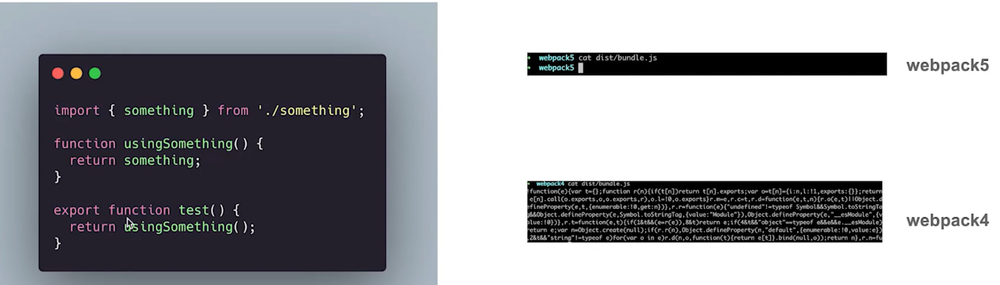

## 代码生成：支持生成 ES6 代码

在 webpack4 之前只能生成 ES5 代码，webpack5 既可以生成 ES5 的代码，也可以生成 ES6/ES2015 的代码

两种设置方式：5 <= ecmaVersion <= 11 或者 2009 <= ecmaVersion <= 2020 -- 写具体版本或对应的年号

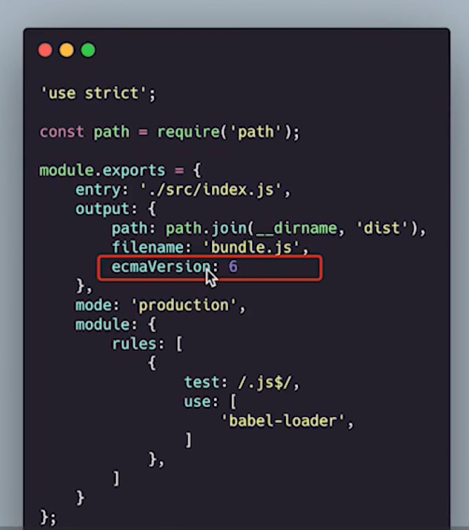

## 开创性的特性：模块联邦

### 1. 应用

可以实现微前端

### 2. 概念

使一个 JavaScript 应用，在运行时，可以动态的去加载另一个应用暴露出来的一些代码，通过 CDN 的方式去加载，这里面是有网络请求的

就是我们在应用 A 通过 CDN 去加载应用 B，然后这两个应用非别在不同的端口

### 3. 好处

Q：如果我们使用以前的webpack，要想做到两个独立的应用共享代码怎么办？

A：我们需要把共享的代码打包成一个 NPM 包，然后发布出去，然后 A 应用和 B 应用分别把 npm 包 require 进来，这是之前的方式

在 webpack5 使模块、组件代码共享更加方便了，尤其是在多个应用之间

### 4. Remote

Remote 是被依赖方，它提供一些组件出来，或者提供一些模块出来，给其它的依赖方去用，它就相当于一个服务提供方

### 5. Host

Host 就是依赖方、消费者

## 开创性的特性：ModuleFederationPlugin

webpack 内部通过 ModuleFederationPlugin 插件将多个应用结合起来

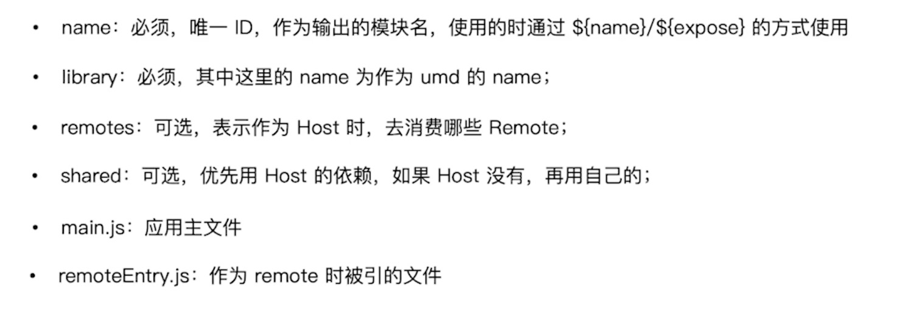

生产者（remote）暴露出来的名称是 app2，暴露出来的模块是 exposes，把 Button 这个组件暴露出来了

（左图）指定 remotes ，就是它要消费的应用

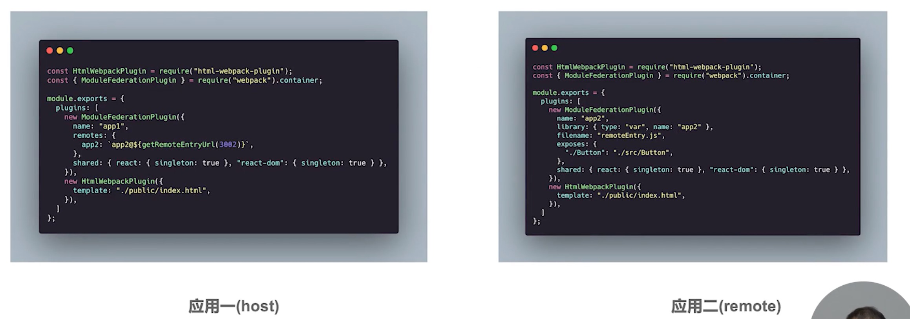

webpack 打包的时候把 optimization:{minimize: false}，这样打包出来的内容就不会被压缩，方便查看（dev）

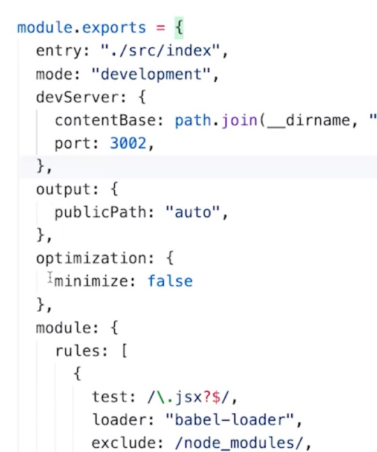

## webpack4 和 webpack5 构建速度对比

webpack5 比 webpack4 构建速度和体积有提，但是开发阶段的提升不是特别明显，如果我们想开发体验有一个大的体验，可以使用 bundless

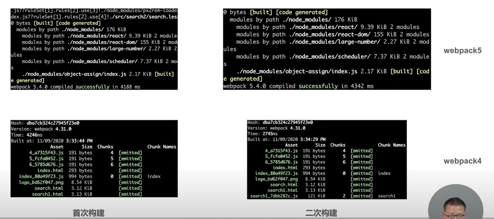

