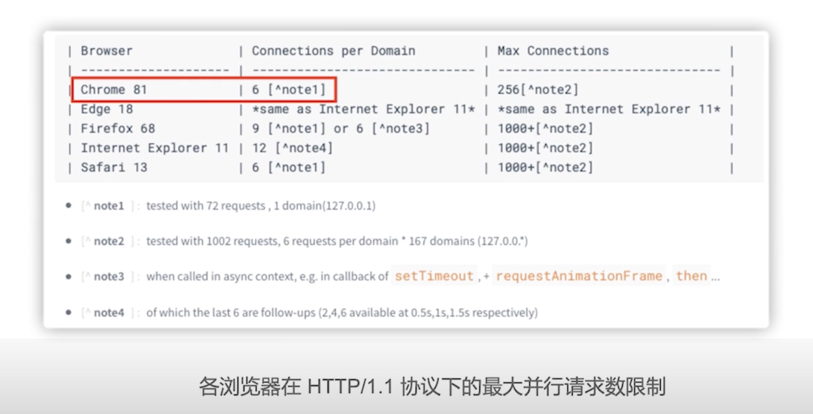
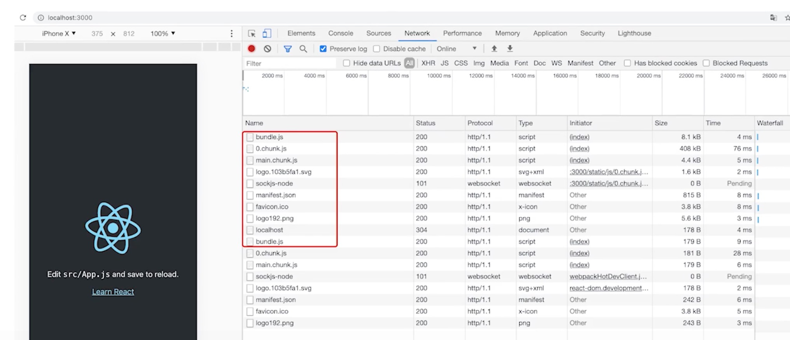
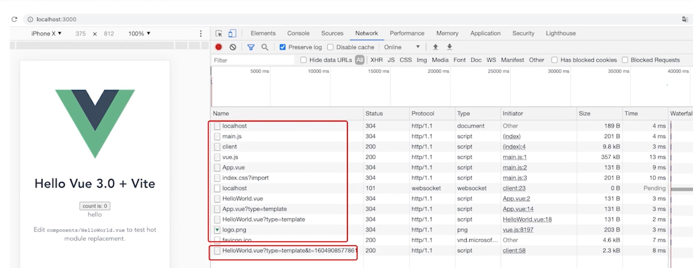
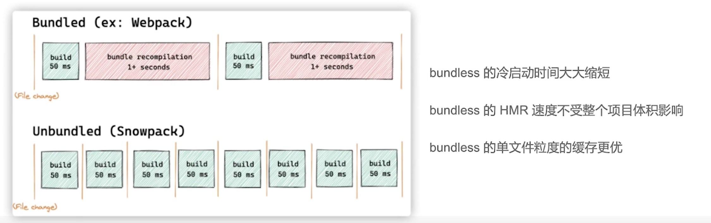
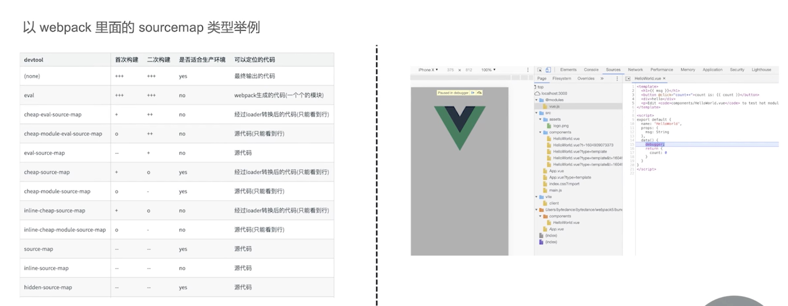

## bundle 和 bundless 的差异

### 浏览器对 ESM 的支持情况

https://caniuse.com/?search=javascript%20modules

可以发现大部分都是支持的 `<script type="module">`

### 请求数

我们使用构建工具，其中一个目的就是把这些资源的请求数进行合并，比如把多个文件合并成一个文件，那么这个请求数就会有一个比较大幅的减少

http1.1 chrome 最大的请求数是六个（下图）

在 http2 这个请求数是没有限制的了

Q：判断浏览器是否启动了 htpp2

A：window.chrome.loadTimes() 下的 connectionInfo 

随着慢慢切换到 http2 了，bundless 也是有一定的用武之地

### 差异

1. 基于 bundle 这种构建工具的浏览器，它最终只是请求了一个 bundle.js 文件

2. 在 bundless 模式下，浏览器不再只是请求一个文件，而是请求多个文件，比如a、b、c、d、浏览器会直接去加载这些模块，这是它资源加载的一个差异

bundless 是直接加载我们的源文件，比如 HelloWorld.vue，App.vue 等等

### 打包速度对比

像 bundle 构建，某一个文件发生了变化，那么 HMR 过程中，它其实是会重新生成一个 bundle 文件，

在 bundless 中，只会把变化的文件推送到浏览器中进行更新

可以发现，在开发阶段，bundless 的体验是更优的

### 调试体验

bundless 在开发阶段是不需要依赖 sourceMap 的，只需要在代码里写一个 debugger 就可以调试了

