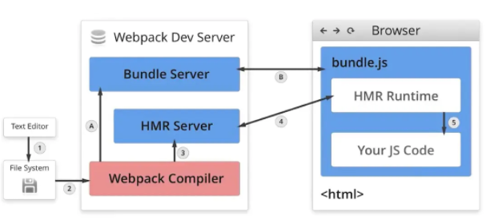

## 热更新

HMR全称 Hot Module Replacement

在webpack中配置开启热模块也非常的简单，如下代码：

```
const webpack = require('webpack')
module.exports = {
	entry: ['react-hot-loader/patch', './src'],
  // ...
  devServer: {
    // 开启 HMR 特性
    hot: true
  },
	plugins: [
		new webpack.HotModuleReplacementPlugin()
	],
  module: {
    rules: [
      {
       test: /\.css$/,
       use: ['style-loader', 'css-loader']
     }
   ]
 },
}
```

```
// 原理就是这个判断的，然后我们使用别人封装好的各种loader就可以了，不需要这个写法
if(module.hot){
    module.hot.accept('./util.js',()=>{
        console.log("util.js更新了")
    })
}
```
`React的HMR`
```
// .babelrc
{
  "plugins": ["react-hot-loader/babel"]
}
```

```
// App.js
import { hot } from 'react-hot-loader/root';
const App = () => <div>Hello World!</div>;
export default hot(App);
```

`工作原理`



- Webpack Compile：将 JS 源代码编译成 bundle.js
- HMR Server：用来将热更新的文件输出给 HMR Runtime
- Bundle Server：静态资源文件服务器，提供文件访问路径
- HMR Runtime：socket服务器，会被注入到浏览器，更新文件的变化
- bundle.js：构建输出的文件
- 在HMR Runtime 和 HMR Server之间建立 websocket，即图上4号线，用于实时更新文件变化

### 启动阶段为上图 1 - 2 - A - B

在编写未经过**webpack**打包的源代码后，**Webpack Compile** 将源代码和 **HMR Runtime** 一起编译成 bundle文件，传输给**Bundle Server** 静态资源服务器


### 更新阶段为上图 1 - 2 - 3 - 4

构建 bundle 的时候，加入一段 **HMR runtime** 的 js 和  **一段和服务沟通的 js** 。文件修改会触发 webpack 重新构建，服务器通过向浏览器发送更新消息，浏览器通过 **jsonp 拉取更新**的模块文件，jsonp **回调触发模块热替换逻辑**。