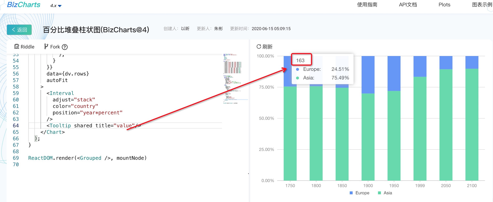

## 官网

> https://www.bizcharts.net/


## tooltip

<Tooltip shared title="date"/>

title: 设置 tooltip 的标题展示的数据字段，设置该字段后，该标题即会展示该字段对应的数值。

showTitle： 为 false 时，该设置不生效。

shared：是否展示多条 tooltip, 默认值:false;false表示只展示单条 tooltip




自定义上面图片展示的信息

```
<Tooltip shared title="date">
{(title, items) => {
	return (
		<div className='padding'>
			{title}
			<div className='padding'>
				{items.map((it) => {
					return (
						<div className='div'>
							<span className='span' style={{ background: it.color }}/>
							{it.data.result} : {it.data.value}({it.data.proportion})
						</div>
					);
				})}
			</div>
		</div>
	);
}}
</Tooltip>
```