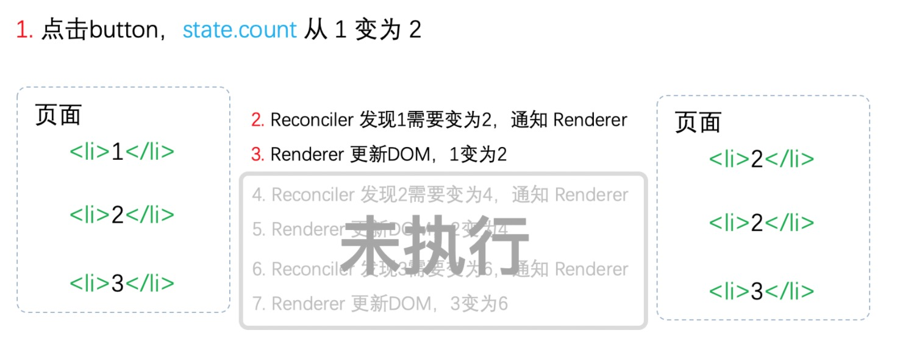
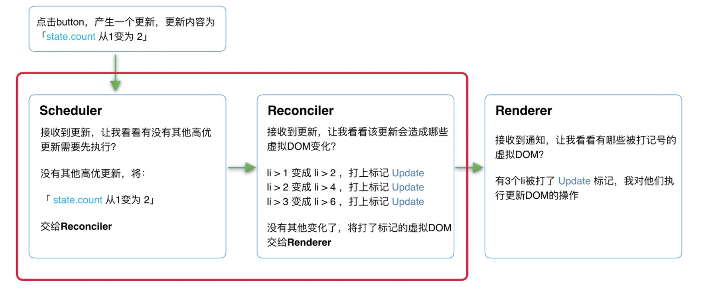

魔术师卡颂

> https://ke.segmentfault.com/course/1650000023864436

## React15架构

React15架构可以分为两层：

- Reconciler（协调器）—— 负责找出变化的组件

- Renderer（渲染器）—— 负责将变化的组件渲染到页面上

### Reconciler（协调器）

我们知道，在React中可以通过this.setState、this.forceUpdate、ReactDOM.render等API触发更新。

每当有更新发生时，Reconciler会做如下工作：

- 调用函数组件、或class组件的render方法，将返回的JSX转化为虚拟DOM

- 将虚拟DOM和上次更新时的虚拟DOM对比

- 通过对比找出本次更新中变化的虚拟DOM

- 通知Renderer将变化的虚拟DOM渲染到页面上

> https://zh-hans.reactjs.org/docs/codebase-overview.html#reconcilers


### Renderer（渲染器）

由于React支持跨平台，所以不同平台有不同的Renderer。我们前端最熟悉的是负责在浏览器环境渲染的Renderer —— [**ReactDOM**](https://www.npmjs.com/package/react-dom)。

除此之外，还有：

- **ReactNative** 渲染器，渲染App原生组件

- **ReactTest** 渲染器，渲染出纯Js对象用于测试

- **ReactArt** 渲染器，渲染到Canvas, SVG 或 VML (IE8)


> https://zh-hans.reactjs.org/docs/codebase-overview.html#renderers


### React15架构的缺点

在Reconciler中，mount的组件会调用 [**mountComponent**](https://github.com/facebook/react/blob/15-stable/src/renderers/dom/shared/ReactDOMComponent.js#L498)，update的组件会调用 [**updateComponent**](https://github.com/facebook/react/blob/15-stable/src/renderers/dom/shared/ReactDOMComponent.js#L498)。这两个方法都会递归更新子组件。


递归更新的缺点:

由于递归执行，所以更新一旦开始，中途就无法中断。当层级很深时，递归更新时间超过了16ms，用户交互就会卡顿。


`以下是我们模拟中断的情况，实际上React15并不会中断进行中的更新`



当第一个li完成更新时中断更新，即步骤3完成后中断更新，此时后面的步骤都还未执行。

用户本来期望123变为246。实际却看见更新不完全的DOM！（即223）

基于这个原因，React决定重写整个架构。(16v不再是交替了)


## React16架构

React16架构可以分为三层：

- Scheduler（调度器）—— 调度任务的优先级，高优任务优先进入Reconciler

- Reconciler（协调器）—— 负责找出变化的组件

- Renderer（渲染器）—— 负责将变化的组件渲染到页面上

### Scheduler（调度器）

既然以浏览器是否有剩余时间作为任务中断的标准，那么我们需要一种机制，当浏览器有剩余时间时通知我们。

React实现了功能更完备的[**requestIdleCallback**](https://developer.mozilla.org/zh-CN/docs/Web/API/Window/requestIdleCallback) polyfill，这就是Scheduler。除了在空闲时触发回调的功能外，Scheduler还提供了多种调度优先级供任务设置。

[**Scheduler**](https://github.com/facebook/react/blob/1fb18e22ae66fdb1dc127347e169e73948778e5a/packages/scheduler/README.md) 是独立于React的库


### Reconciler（协调器）

在React15中Reconciler是**递归处理虚拟DOM**的。让我们看看[**React16的Reconciler**](https://github.com/facebook/react/blob/1fb18e22ae66fdb1dc127347e169e73948778e5a/packages/react-reconciler/src/ReactFiberWorkLoop.new.js#L1673)

`在React16中Reconciler内部采用了Fiber的架构`

`我们会逐渐用Fiber来取代React16虚拟DOM这一称呼。`

我们可以看见，更新工作从递归变成了可以中断的循环过程。每次循环都会调用**shouldYield**判断当前是否有剩余时间。

```
/** @noinline */
function workLoopConcurrent() {
  // Perform work until Scheduler asks us to yield
  while (workInProgress !== null && !shouldYield()) {
    workInProgress = performUnitOfWork(workInProgress);
  }
}
```


在React16中，[**Reconciler**](https://zh-hans.reactjs.org/docs/codebase-overview.html#fiber-reconciler)与**Renderer**不再是交替工作。当**Scheduler**将任务交给**Reconciler**后，**Reconciler**会为变化的虚拟DOM打上代表增/删/更新的标记，类似这样：

```
export const Placement = /*             */ 0b0000000000010;
export const Update = /*                */ 0b0000000000100;
export const PlacementAndUpdate = /*    */ 0b0000000000110;
export const Deletion = /*              */ 0b0000000001000;
```

全部的标记见[**这里**](https://github.com/facebook/react/blob/1fb18e22ae66fdb1dc127347e169e73948778e5a/packages/react-reconciler/src/ReactSideEffectTags.js)


### Renderer（渲染器)

**Renderer**根据**Reconciler**为虚拟DOM打的标记，同步执行对应的DOM操作。

### 在React16架构中整个更新流程为：



其中红框中的步骤随时可能由于以下原因被中断：

- 有其他更高优任务需要先更新

- 当前帧没有剩余时间


实际上，由于Scheduler和Reconciler都是平台无关的，所以React为他们单独发了一个包[**react-Reconciler**](https://www.npmjs.com/package/react-reconciler)。你可以用这个包自己实现一个ReactDOM，具体见[**参考资料**](https://www.youtube.com/watch?v=CGpMlWVcHok&list=PLPxbbTqCLbGHPxZpw4xj_Wwg8-fdNxJRh&index=7)