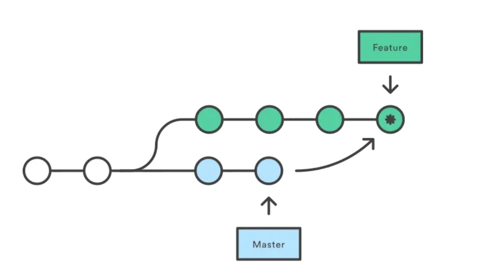
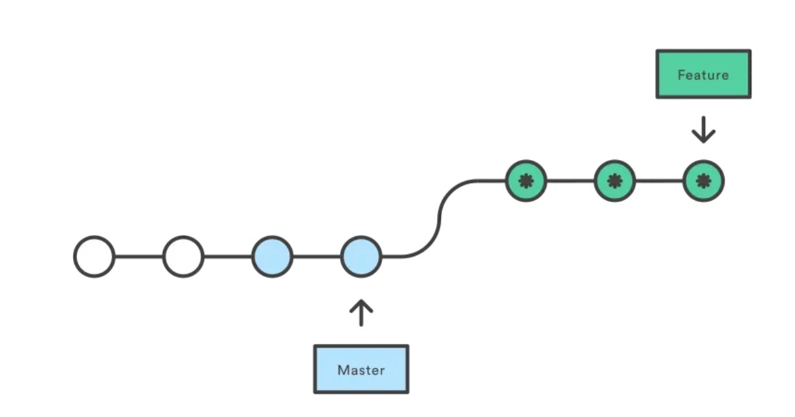

## 1. git merge or rebase

### merage

```
git checkout feature
git merge master
```

```
git merge feature master
```

使用 merge 是很好的方式，因为它是一种 非破坏性的 操作。现有分支不会以任何方式被更改。这避免了 rebase 操作所产生的潜在缺陷（下面讨论）。


另一方面，这也意味着 **feature** 分支每次需要合并上游更改时，它都将产生一个额外的合并提交。如果 **master** 提交非常活跃，这可能会严重污染你的 feature 分支历史记录。尽管可以使用高级选项 **git log** 缓解此问题，**但它可能使其他开发人员难以理解项目的历史记录**





### rebase

```
git checkout feature
git rebase master
```

这会将整个 **feature** 分支移动到 **master** 分支的顶端，从而有效地整合了所有 **master** 分支上的提交。但是，与 merge 提交方式不同，rebase 通过为原始分支中的每个提交创建全新的 commits 来 重写 项目历史记录




`git rebase 的黄金法则是永远不要在公共分支上使用它`

> https://juejin.cn/post/6844903890295455751


## 2. git stash

git stash -- 保存当前工作进度，会把**暂存区**和**工作区**的改动保存起来

git stash save "save message"  --  比上面方便

- --keep-index 或者 -k    储藏时只保存工作目录中的变更，保持已暂存的变更在暂存区中不动：
- --include-untracked     同时保存工作目录未跟踪和已跟踪文件和暂存区的修改
- -a 或者 --all 命令可以当前目录下的所有修改，包括被 git 忽略的文件

git stash list  --  显示保存进度的列表

git stash pop  --  从栈中读取最近一次保存的内容，也就是栈顶的stash会恢复到工作区

git stash pop + stash名字  --  恢复哪个stash恢复到当前目录

git stash apply  -- 将栈中的内容应用到当前目录，不同于git stash pop，该命令不会将内容从栈中删除

git stash drop  --  git stash drop + stash名称表示从堆栈中移除某个指定的stash

git stash clear  --  删除所有存储的进度


1. 当你的开发进行到一半,但是代码还不想进行提交 ,然后需要同步去关联远端代码时：

- git stash
- git pull
- git stash pop


2. 当你开发到一半，现在要修改别的分支问题的时候，你也可以使用git stash缓存当前区域的代码

- git stash：保存开发到一半的代码
- git commit -m '修改问题'
- git stash pop：将代码追加到最新的提交之后
