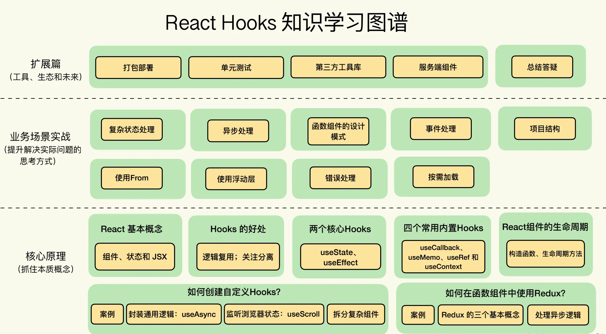
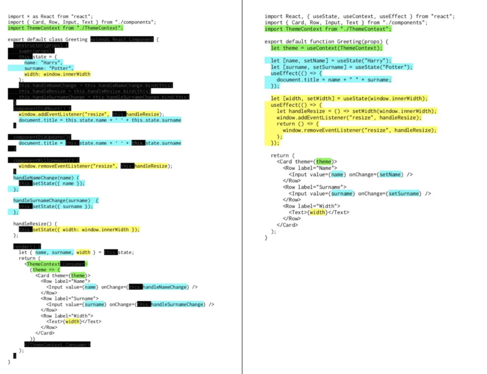
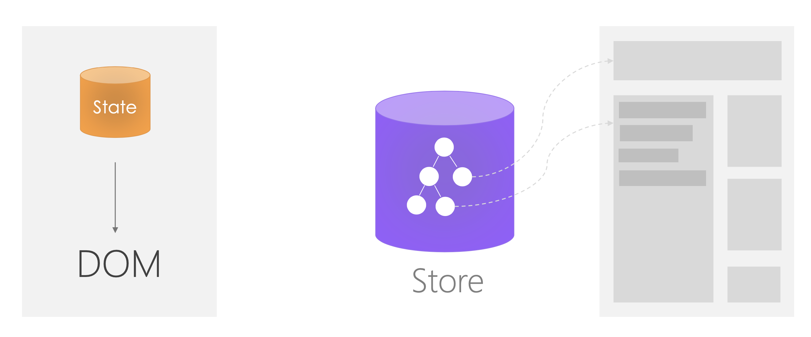

## 基础

### 1. 父组件获取子组件的值

> https://8kvzu.csb.app/#/Parent


### 2. ref

> https://mvv1f.csb.app/#/RefTestForm

### 3. 组件的本质

`我们可以把 UI 的展现看成一个函数的执行过程。`
`其中，Model 是输入参数，函数的执行结果是 DOM 树，也就是 View。`
`而 React 要保证的，就是每当 Model 发生变化时，函数会重新执行，并且生成新的 DOM 树，`
`然后 React 再把新的 DOM 树以最优的方式更新到浏览器。`


### 4. state的原则

`遵循的一个原则就是：state 中永远不要保存可以通过计算得到的值。`

## class

### 1. React中setState是同步的还是异步

> https://juejin.cn/post/6844903636749778958


## hooks基础

### 学习路径



### 1. 好处

1. 逻辑复用（高阶函数/render props模式）

2. 针对同一个业务逻辑的代码尽可能聚合在一块儿



### 2. 刷新原理

`Hooks 让组件刷新和传统 class 组件触发刷新的机制是完全一样的，`
`都是由 state 或者 props 变化触发。Hooks 中的 useState 和 class 中的 setState，背后是同一套实现`


### 3. 组合和继承

`组合让组件交互方式更加简单，只有 props。`
`而继承则比较复杂，因为存在父方法调用或者覆盖等场景。`
`不过因为现在都是函数组件，所以就一定是组合的方式了`


### 4. 数据源

窗口大小作为 Hooks 的数据源：

> https://codesandbox.io/s/dongbeidaluantun-8kvzu?file=/src/HocWindowInnerHeight/HeightHook.js

定时器，监听滚动，键盘事件，复用Fetch。

### 5. useState


#### 1. initialState


`它可以是任意类型，比如数字、对象、数组等等。`

```
// 定义一个年龄的 state，初始值是 42
const [age, setAge] = useState(42);

// 定义一个水果的 state，初始值是 banana
const [fruit, setFruit] = useState('banana');

// 定一个一个数组 state，初始值是包含一个 todo 的数组
const [todos, setTodos] = useState([{ text: 'Learn Hooks' }]);
```

#### 2. count计数器：

> https://8kvzu.csb.app/#/Counter

#### 3. userList：

> https://8kvzu.csb.app/#/UserList


### 6. useEffect

#### 1. 语法

`useEffect 是每次组件 render 完后判断依赖并执行。`


`第一个为要执行的函数 callback;`

`第二个是可选的依赖项数组 dependencies;`


```
useEffect(callback, dependencies)
```

1. 没有依赖项，则每次 render 后都会重新执行

```
useEffect(() => {
  // 每次 render 完一定执行
  console.log('re-rendered');
});

```


2. 空数组作为依赖项，则只在首次执行时触发，对应到 Class 组件就是 componentDidMount

```
useEffect(() => {
  // 组件首次渲染时执行，等价于 class 组件中的 componentDidMount
  console.log('did mount');
}, [])
```


3. 第一次以及依赖项发生变化后执行：提供依赖项数组

```
useEffect(() => {}, [deps])
```

`即使这个是对象obj={},或者数据对象arr=[{},{}]，做为依赖项，也会等setObj去比较，或者props传值比较`

```
// 这个时候不会死循环，因为依赖项里没有obj
useEffect(() => {
  setObj(obj)
}, [newObj])
```

```
// 这个会死循环
useEffect(() => {
  setObj(obj)
}, [obj])
```


4. 组件 unmount 后执行：返回一个回调函数

`每次执行都是清除上一次的数据`

`参数是空的时候：只有在最后组件卸载的时候执行一次`

```
// 设置一个 size 的 state 用于保存当前窗口尺寸
const [size, setSize] = useState({});
useEffect(() => {
  // 窗口大小变化事件处理函数
  const handler = () => {
    setSize(getSize());
  };
  // 监听 resize 事件
  window.addEventListener('resize', handler);
  
  // 返回一个 callback 在组件销毁时调用
  return () => {
    // 移除 resize 事件
    window.removeEventListener('resize', handler);
  };
}, []);
```


5. 请求例子

```
import React, { useState, useEffect } from "react";

function BlogView({ id }) {
  // 设置一个本地 state 用于保存 blog 内容
  const [blogContent, setBlogContent] = useState(null);

  useEffect(() => {
    // useEffect 的 callback 要避免直接的 async 函数，需要封装一下
    const doAsync = async () => {
      // 当 id 发生变化时，将当前内容清除以保持一致性
      setBlogContent(null);
      // 发起请求获取数据
      const res = await fetch(`/blog-content/${id}`);
      // 将获取的数据放入 state
      setBlogContent(await res.text());
    };
    doAsync();
  }, [id]); // 使用 id 作为依赖项，变化时则执行副作用

  // 如果没有 blogContent 则认为是在 loading 状态
  const isLoading = !blogContent;
  return <div>{isLoading ? "Loading..." : blogContent}</div>;
}
```


### 7. useCallback

```
function Counter() {
  const [count, setCount] = useState(0);
  // 每次都需要创建一个新handleIncrement
  const handleIncrement = () => setCount(count + 1);
  // ...
  return <button onClick={handleIncrement}>+</button>
}
```

使用useCallback优化：

```
import React, { useState, useCallback } from 'react';

function Counter() {
  const [count, setCount] = useState(0);
  const handleIncrement = useCallback(
    () => setCount(count + 1),
    [count], // 只有当 count 发生变化时，才会重新创建回调函数
  );
  // ...
  return <button onClick={handleIncrement}>+</button>
}

```


### 8. useMemo

`果某个数据是通过其它数据计算得到的，那么只有当用到的数据，也就是依赖的数据发生变化的时候，才应该需要重新计算`

```

import React, { useState, useEffect } from "react";

export default function SearchUserList() {
  // 用户列表数据本身：来自某个请求
  const [users, setUsers] = useState(null);
  // 搜索关键字：用户在搜索框输入的数据
  const [searchKey, setSearchKey] = useState("");

  useEffect(() => {
    const doFetch = async () => {
      // 组件首次加载时发请求获取用户数据
      const res = await fetch("https://reqres.in/api/users/");
      setUsers(await res.json());
    };
    doFetch();
  }, []);
  let usersToShow = null;

  if (users) {
    // 无论组件为何刷新，这里一定会对数组做一次过滤的操作
    usersToShow = users.data.filter((user) =>
      user.first_name.includes(searchKey),
    );
  }

  return (
    <div>
      <input
        type="text"
        value={searchKey}
        onChange={(evt) => setSearchKey(evt.target.value)}
      />
      <ul>
        {usersToShow &&
          usersToShow.length > 0 &&
          usersToShow.map((user) => {
            return <li key={user.id}>{user.first_name}</li>;
          })}
      </ul>
    </div>
  );
}
```


`无论组件为何要进行一次重新渲染，实际上都需要进行一次过滤的操作。`
`但其实你只需要在 users 或者 searchKey 这两个状态中的某一个发生变化时，重新计算获得需要展示的数据就行了`


```
//...
// 使用 userMemo 缓存计算的结果
const usersToShow = useMemo(() => {
    if (!users) return null;
    return users.data.filter((user) => {
      return user.first_name.includes(searchKey));
    }
  }, [users, searchKey]);
//...
```

### 9. useCallback/useMemo

**useCallback 的功能其实是可以用 useMemo 来实现的**

```
 const myEventHandler = useMemo(() => {
   // 返回一个函数作为缓存结果
   return () => {
     // 在这里进行事件处理
   }
 }, [dep1, dep2]);
```


### 10. useRef

1. 存储跨渲染的数据

`useRef 区别于 useState 的地方: `
  `使用 useRef 保存的数据一般是和 UI 的渲染无关的，因此当 ref 的值发生变化时，是不会触发组件的重新渲染的，`

```
import React, { useState, useCallback, useRef } from "react";

export default function Timer() {
  // 定义 time state 用于保存计时的累积时间
  const [time, setTime] = useState(0);

  // 定义 timer 这样一个容器用于在跨组件渲染之间保存一个变量
  const timer = useRef(null);

  // 开始计时的事件处理函数
  const handleStart = useCallback(() => {
    // 使用 current 属性设置 ref 的值
    timer.current = window.setInterval(() => {
      setTime((time) => time + 1);
    }, 100);
  }, []);

  // 暂停计时的事件处理函数
  const handlePause = useCallback(() => {
    // 使用 clearInterval 来停止计时
    window.clearInterval(timer.current);
    timer.current = null;
  }, []);

  return (
    <div>
      {time / 10} seconds.
      <br />
      <button onClick={handleStart}>Start</button>
      <button onClick={handlePause}>Pause</button>
    </div>
  );
}
```

2. 保存某个 DOM 节点的引用

`点击某个按钮时让某个输入框获得焦点`

```
function TextInputWithFocusButton() {
  const inputEl = useRef(null);
  const onButtonClick = () => {
    // current 属性指向了真实的 input 这个 DOM 节点，从而可以调用 focus 方法
    inputEl.current.focus();
  };
  return (
    <>
      <input ref={inputEl} type="text" />
      <button onClick={onButtonClick}>Focus the input</button>
    </>
  );
}
```


### 11. useContext

主题的切换

```
const themes = {
  light: {
    foreground: "#000000",
    background: "#eeeeee"
  },
  dark: {
    foreground: "#ffffff",
    background: "#222222"
  }
};
// 创建一个 Theme 的 Context

const ThemeContext = React.createContext(themes.light);
function App() {
  // 整个应用使用 ThemeContext.Provider 作为根组件
  return (
    // 使用 themes.dark 作为当前 Context 
    <ThemeContext.Provider value={themes.dark}>
      <Toolbar />
    </ThemeContext.Provider>
  );
}

// 在 Toolbar 组件中使用一个会使用 Theme 的 Button
function Toolbar(props) {
  return (
    <div>
      <ThemedButton />
    </div>
  );
}

// 在 Theme Button 中使用 useContext 来获取当前的主题
function ThemedButton() {
  const theme = useContext(ThemeContext);
  return (
    <button style={{
      background: theme.background,
      color: theme.foreground
    }}>
      I am styled by theme context!
    </button>
  );
}
```


Context 相当于提供了一个定义 React 世界中全局变量的机制，而全局变量则意味着两点：

`1. 会让调试变得困难，因为你很难跟踪某个 Context 的变化究竟是如何产生的。`

`2. 让组件的复用变得困难，因为一个组件如果使用了某个 Context，它就必须确保被用到的地方一定有这个 Context 的 Provider 在其父组件的路径上。`


除了像 Theme、Language 等一目了然的需要全局设置的变量外，我们很少会使用 Context 来做太多数据的共享（使用redux）


### 12. useReducer

`在某些场景下，useReducer 会比 useState 更适用，`
`例如 state 逻辑较复杂且包含多个子值，或者下一个 state 依赖于之前的 state 等。`
`并且，使用 useReducer 还能给那些会触发深更新的组件做性能优化，因为你可以向子组件传递 dispatch 而不是回调函数 `

用 reducer 重写 useState 的计数器示例：

```
const initialState = {count: 0};

function reducer(state, action) {
  switch (action.type) {
    case 'increment':
      return {count: state.count + 1};
    case 'decrement':
      return {count: state.count - 1};
    default:
      throw new Error();
  }
}

function Counter() {
  const [state, dispatch] = useReducer(reducer, initialState);
  return (
    <>
      Count: {state.count}
      <button onClick={() => dispatch({type: 'decrement'})}>-</button>
      <button onClick={() => dispatch({type: 'increment'})}>+</button>
    </>
  );
}
```


1. 惰性初始化

`这么做可以将用于计算 state 的逻辑提取到 reducer 外部，这也为将来对重置 state 的 action 做处理提供了便利：`


```
function init(initialCount) {
  return {count: initialCount};
}

function reducer(state, action) {
  switch (action.type) {
    case 'increment':
      return {count: state.count + 1};
    case 'decrement':
      return {count: state.count - 1};
    case 'reset':
      return init(action.payload);
    default:
      throw new Error();
  }
}

function Counter({initialCount}) {
  const [state, dispatch] = useReducer(reducer, initialCount, init);
  return (
    <>
      Count: {state.count}
      <button
        onClick={() => dispatch({type: 'reset', payload: initialCount})}>
        Reset
      </button>
      <button onClick={() => dispatch({type: 'decrement'})}>-</button>
      <button onClick={() => dispatch({type: 'increment'})}>+</button>
    </>
  );
}
```


### 13. useImperativeHandle

```
useImperativeHandle(ref, createHandle, [deps])
```

`useImperativeHandle 可以让你在使用 ref 时自定义暴露给父组件的实例值。`

`在大多数情况下，应当避免使用 ref 这样的命令式代码。`

`useImperativeHandle 应当与 forwardRef 一起使用：`

> https://8kvzu.csb.app/#/FancyInput


### 14. useLayoutEffect

`其函数签名与 useEffect 相同，但它会在所有的 DOM 变更之后同步调用 effect。`

`可以使用它来读取 DOM 布局并同步触发重渲染。`

`在浏览器执行绘制之前，useLayoutEffect 内部的更新计划将被同步刷新。`

`先用 useEffect，只有当它出问题的时候再尝试使用 useLayoutEffect。`


### 15. useDebugValue

TODO


### 16. 自定义hook

`声明一个名字以 use 开头的函数`

`如果你创建了一个 useXXX 的函数，但是内部并没有用任何其它 Hooks，就只是一个普通的函数。`

#### 1. useCounter: 计数器改造

> https://8kvzu.csb.app/#/UseCounter

#### 2. useAsync: 封装通用逻辑

请求用户列表：
```
import React from "react";

export default function UserList() {
  // 使用三个 state 分别保存用户列表，loading 状态和错误状态
  const [users, setUsers] = React.useState([]);
  const [loading, setLoading] = React.useState(false);
  const [error, setError] = React.useState(null);

  // 定义获取用户的回调函数
  const fetchUsers = async () => {
    setLoading(true);
    try {
      const res = await fetch("https://reqres.in/api/users/");
      const json = await res.json();
      // 请求成功后将用户数据放入 state
      setUsers(json.data);
    } catch (err) {
      // 请求失败将错误状态放入 state
      setError(err);
    }
    setLoading(false);
  };

  return (
    <div className="user-list">
      <button onClick={fetchUsers} disabled={loading}>
        {loading ? "Loading..." : "Show Users"}
      </button>
      {error && 
        <div style={{ color: "red" }}>Failed: {String(error)}</div>
      }
      <br />
      <ul>
        {users && users.length > 0 &&
          users.map((user) => {
            return <li key={user.id}>{user.first_name}</li>;
          })}
      </ul>
    </div>
  );
}
```


封装请求：

`利用了 Hooks 能够管理 React 组件状态的能力，将一个组件中的某一部分状态独立出来，从而实现了通用逻辑的重用`

```
import { useState } from 'react';

const useAsync = (asyncFunction) => {
  // 设置三个异步逻辑相关的 state
  const [data, setData] = useState(null);
  const [loading, setLoading] = useState(false);
  const [error, setError] = useState(null);
  // 定义一个 callback 用于执行异步逻辑
  const execute = useCallback(() => {
    // 请求开始时，设置 loading 为 true，清除已有数据和 error 状态
    setLoading(true);
    setData(null);
    setError(null);
    return asyncFunction()
      .then((response) => {
        // 请求成功时，将数据写进 state，设置 loading 为 false
        setData(response);
        setLoading(false);
      })
      .catch((error) => {
        // 请求失败时，设置 loading 为 false，并设置错误状态
        setError(error);
        setLoading(false);
      });
  }, [asyncFunction]);

  return { execute, loading, data, error };
};
```

使用：

```
import React from "react";
import useAsync from './useAsync';

export default function UserList() {
  // 通过 useAsync 这个函数，只需要提供异步逻辑的实现
  const {
    execute: fetchUsers,
    data: users,
    loading,
    error,
  } = useAsync(async () => {
    const res = await fetch("https://reqres.in/api/users/");
    const json = await res.json();
    return json.data;
  });
  
  return (
    // 根据状态渲染 UI...
  );
}
```


#### 3. useScroll: 监听浏览器状态

监听滚动条位置：
```
import { useState, useEffect } from 'react';

// 获取横向，纵向滚动条位置
const getPosition = () => {
  return {
    x: document.body.scrollLeft,
    y: document.body.scrollTop,
  };
};
const useScroll = () => {
  // 定一个 position 这个 state 保存滚动条位置
  const [position, setPosition] = useState(getPosition());
  useEffect(() => {
    const handler = () => {
      setPosition(getPosition(document));
    };
    // 监听 scroll 事件，更新滚动条位置
    document.addEventListener("scroll", handler);
    return () => {
      // 组件销毁时，取消事件监听
      document.removeEventListener("scroll", handler);
    };
  }, []);
  return position;
};

```


返回顶部功能、使用上面的hook：
```
import React, { useCallback } from 'react';
import useScroll from './useScroll';

function ScrollTop() {
  const { y } = useScroll();

  const goTop = useCallback(() => {
    document.body.scrollTop = 0;
  }, []);

  const style = {
    position: "fixed",
    right: "10px",
    bottom: "10px",
  };
  // 当滚动条位置纵向超过 300 时，显示返回顶部按钮
  if (y > 300) {
    return (
      <button onClick={goTop} style={style}>
        Back to Top
      </button>
    );
  }
  // 否则不 render 任何 UI
  return null;
}

```


#### 4. 拆分复杂组件

`保持每个函数的短小`

`尽量将相关的逻辑做成独立的 Hooks，然后在函数组中使用这些 Hooks，通过参数传递和返回值让 Hooks 之间完成交互`


```
// 需求：我们需要展示一个博客文章的列表，并且有一列要显示文章的分类。
//      同时，我们还需要提供表格过滤功能，以便能够只显示某个分类的文章

function BlogList() {
  // 获取文章列表...
  // 获取分类列表...
  // 组合文章数据和分类数据...
  // 根据选择的分类过滤文章...
  
  // 渲染 UI ...
}
```

`这个例子中抽取出来的 Hooks 都非常简单，甚至看上去没有必要`

`但是实际的开发场景一定是比这个复杂的，比如对于 API 返回的数据需要做一些数据的转换，进行数据的缓存，等等。`

`那么这时就要避免把这些逻辑都放到一起，而是就要拆分到独立的 Hooks，以免产生过于复杂的组件。到时候你也就更能更体会到 Hooks 带给你的惊喜了。`

```
import React, { useEffect, useCallback, useMemo, useState } from "react";
import { Select, Table } from "antd";
import _ from "lodash";
import useAsync from "./useAsync";

const endpoint = "https://myserver.com/api/";
const useArticles = () => {
  // 使用上面创建的 useAsync 获取文章列表
  const { execute, data, loading, error } = useAsync(
    useCallback(async () => {
      const res = await fetch(`${endpoint}/posts`);
      return await res.json();
    }, []),
  );
  // 执行异步调用
  useEffect(() => execute(), [execute]);
  // 返回语义化的数据结构
  return {
    articles: data,
    articlesLoading: loading,
    articlesError: error,
  };
};
const useCategories = () => {
  // 使用上面创建的 useAsync 获取分类列表
  const { execute, data, loading, error } = useAsync(
    useCallback(async () => {
      const res = await fetch(`${endpoint}/categories`);
      return await res.json();
    }, []),
  );
  // 执行异步调用
  useEffect(() => execute(), [execute]);

  // 返回语义化的数据结构
  return {
    categories: data,
    categoriesLoading: loading,
    categoriesError: error,
  };
};
const useCombinedArticles = (articles, categories) => {
  // 将文章数据和分类数据组合到一起
  return useMemo(() => {
    // 如果没有文章或者分类数据则返回 null
    if (!articles || !categories) return null;
    return articles.map((article) => {
      return {
        ...article,
        category: categories.find(
          (c) => String(c.id) === String(article.categoryId),
        ),
      };
    });
  }, [articles, categories]);
};
const useFilteredArticles = (articles, selectedCategory) => {
  // 实现按照分类过滤
  return useMemo(() => {
    if (!articles) return null;
    if (!selectedCategory) return articles;
    return articles.filter((article) => {
      console.log("filter: ", article.categoryId, selectedCategory);
      return String(article?.category?.name) === String(selectedCategory);
    });
  }, [articles, selectedCategory]);
};

const columns = [
  { dataIndex: "title", title: "Title" },
  { dataIndex: ["category", "name"], title: "Category" },
];

export default function BlogList() {
  const [selectedCategory, setSelectedCategory] = useState(null);
  // 获取文章列表
  const { articles, articlesError } = useArticles();
  // 获取分类列表
  const { categories, categoriesError } = useCategories();
  // 组合数据
  const combined = useCombinedArticles(articles, categories);
  // 实现过滤
  const result = useFilteredArticles(combined, selectedCategory);

  // 分类下拉框选项用于过滤
  const options = useMemo(() => {
    const arr = _.uniqBy(categories, (c) => c.name).map((c) => ({
      value: c.name,
      label: c.name,
    }));
    arr.unshift({ value: null, label: "All" });
    return arr;
  }, [categories]);

  // 如果出错，简单返回 Failed
  if (articlesError || categoriesError) return "Failed";

  // 如果没有结果，说明正在加载
  if (!result) return "Loading...";

  return (
    <div>
      <Select
        value={selectedCategory}
        onChange={(value) => setSelectedCategory(value)}
        options={options}
        style={{ width: "200px" }}
        placeholder="Select a category"
      />
      <Table dataSource={result} columns={columns} />
    </div>
  );
}
```


## Hook + Redux



### 1.Redux 引入的概念

`主要就是三个：State、Action 和 Reducer。`

- 其中 State 即 Store，一般就是一个纯 JavaScript Object。
- Action 也是一个 Object，用于描述发生的动作。
- 而 Reducer 则是一个函数，接收 Action 和 State 并作为参数，通过计算得到新的 Store。


### 2. “加一”和“减一”功能

```
import { createStore } from 'redux'

// 定义 Store 的初始值
const initialState = { value: 0 }

// Reducer，处理 Action 返回新的 State
function counterReducer(state = initialState, action) {
  switch (action.type) {
    case 'counter/incremented':
      return { 
        ...state, // 复制原有的数据结构（只有一层）, 如果是复杂数据，使用 Immutable、Immer 等等
        value: state.value + 1 
      }
    case 'counter/decremented':
      return { 
        ...state,
        value: state.value - 1 
      }
    default:
      return state
  }
}

// 利用 Redux API 创建一个 Store，参数就是 Reducer
const store = createStore(counterReducer)

// Store 提供了 subscribe 用于监听数据变化
store.subscribe(() => console.log(store.getState()))

// 计数器加 1，用 Store 的 dispatch 方法分发一个 Action，由 Reducer 处理
const incrementAction = { type: 'counter/incremented' };
store.dispatch(incrementAction);
// 监听函数输出：{value: 1}

// 计数器减 1
const decrementAction = { type: 'counter/decremented' };
store.dispatch(decrementAction)
// 监听函数输出：{value: 0}
```

### 3. react-redux

`在 React 中使用 Redux`

`在 react-redux 的实现中，为了确保需要绑定的组件能够访问到全局唯一的 Redux Store，`
`利用了 React 的 Conext 机制去存放 Store 的信息。`
`通常我们会将这个 Context 作为整个 React 应用程序的根节点。`

```
import React from 'react'
import ReactDOM from 'react-dom'

import { Provider } from 'react-redux'
import store from './store'

import App from './App'

const rootElement = document.getElementById('root')
ReactDOM.render(
  <Provider store={store}>
    <App />
  </Provider>,
  rootElement
)
```

```
import React from 'react'
import { useSelector, useDispatch } from 'react-redux'

export function Counter() {
  // 从 state 中获取当前的计数值
  const count = useSelector(state => state.value)

  // 获得当前 store 的 dispatch 方法
  const dispatch = useDispatch()

  // 在按钮的 click 时间中去分发 action 来修改 store
  return (
    <div>
      <button
        onClick={() => dispatch({ type: 'counter/incremented' })}
      >+</button>
      <span>{count}</span>
      <button
        onClick={() => dispatch({ type: 'counter/decremented' })}
      >-</button>
    </div>
  )
}

```

### 4. 数据流


### 5. Redux 处理异步

#### 1. 自己实现

`尽管这样做是可行的，但发送请求获取数据并进行错误处理这个逻辑是不可重用的`

`假设我们希望在另外一个组件中也能发送同样的请求，就不得不将这段代码重新实现一遍`

```
function DataList() {
  const dispatch = useDispatch();
  // 在组件初次加载时发起请求
  useEffect(() => {
    // 请求发送时
    dispatch({ type: 'FETCH_DATA_BEGIN' });
    fetch('/some-url').then(res => {
      // 请求成功时
      dispatch({ type: 'FETCH_DATA_SUCCESS', data: res });
    }).catch(err => {
      // 请求失败时
      dispatch({ type: 'FETCH_DATA_FAILURE', error: err });
    })
  }, []);
  
  // 绑定到 state 的变化
  const data = useSelectore(state => state.data);
  const pending = useSelector(state => state.pending);
  const error = useSelector(state => state.error);
  
  // 根据 state 显示不同的状态
  if (error) return 'Error.';
  if (pending) return 'Loading...';
  return <Table data={data} />;
}
```

#### 2. 中间件


`Redux 中的 Action 不仅仅可以是一个 Object，它可以是任何东西，也可以是一个函数。`

`利用这个机制，Redux 提供了 redux-thunk 这样一个中间件，它如果发现接受到的 action 是一个函数，那么就不会传递给 Reducer，`

`而是执行这个函数，并把 dispatch 作为参数传给这个函数，从而在这个函数中你可以自由决定何时，如何发送 Action。`

```
// store
import { createStore, applyMiddleware } from 'redux'
import thunkMiddleware from 'redux-thunk'
import rootReducer from './reducer'

const composedEnhancer = applyMiddleware(thunkMiddleware)
const store = createStore(rootReducer, composedEnhancer)
```

```
function fetchData() {
  return dispatch => {
    dispatch({ type: 'FETCH_DATA_BEGIN' });
    fetch('/some-url').then(res => {
      dispatch({ type: 'FETCH_DATA_SUCCESS', data: res });
    }).catch(err => {
      dispatch({ type: 'FETCH_DATA_FAILURE', error: err });
    })
  }
}
```

```
import fetchData from './fetchData';

function DataList() {
  const dispatch = useDispatch();
  // dispatch 了一个函数由 redux-thunk 中间件去执行
  dispatch(fetchData());
}
```

## Hook + Mobx （TODO）


## Hooks进阶


### 1. 状态一致性


#### 1. 保证状态最小化

`某些数据如果能从已有的 State 中计算得到，那么我们就应该始终在用的时候去计算，而不要把计算的结果存到某个 State 中`


## Class vs Hook

1. 博客

```
class BlogView extends React.Component {
  // ...
  componentDidMount() {
    // 组件第一次加载时去获取 Blog 数据
    fetchBlog(this.props.id);
  }
  componentDidUpdate(prevProps) {
    if (prevProps.id !== this.props.id) {
      // 当 Blog 的 id 发生变化时去获取博客文章
      fetchBlog(this.props.id);
    }
  }
  // ...
}
```

```
function BlogView({ id }) {
  useEffect(() => {
    // 当 id 变化时重新获取博客文章
    fetchBlog(id);
  }, [id]); // 定义了依赖项 id
}
```


2. hook不太好实现的地方

`但是 Class 组件中还有其它一些比较少用的方法，`
`比如 getSnapshotBeforeUpdate, componentDidCatch, getDerivedStateFromError。`
`比较遗憾的是目前 Hooks 还没法实现这些功能。因此如果必须用到，你的组件仍然需要用类组件去实现。`


## 最佳实践


### 页面数据需要来自多个请求

1. 请求之间无依赖关系、可以并发进行

2. 请求有依赖、需要一次进行

3. 请求完成之前、页面显示loading状态 -- loading通过数据的状态来推到、不需要设置一个state

> https://hd1h2.csb.app/#/multiple-request

### React中拖放的实现

1. 如何使用React的鼠标事件系统

2. 如何判断拖放开始和结束

3. 如何实现拖放元素的位置移动

4. 拖放状态在组件中如何维护

自己实现：

> https://hd1h2.csb.app/#/react-dnd

已有库：

> https://github.com/atlassian/react-beautiful-dnd


### 集成第三方js库

d3.js -- 数据驱动ui

> https://d3js.org/

1. 使用ref获取原生DOM节点引用

2. 手动将组件状态更新到DOM节点

3. 组件销毁时移除原生节点DOM事件

> https://hd1h2.csb.app/#/d3-sample


### 封装antd-form表单

Antd3

> https://hd1h2.csb.app/#/form-submit-antd

Antd4

> https://mvv1f.csb.app/#/form-submit